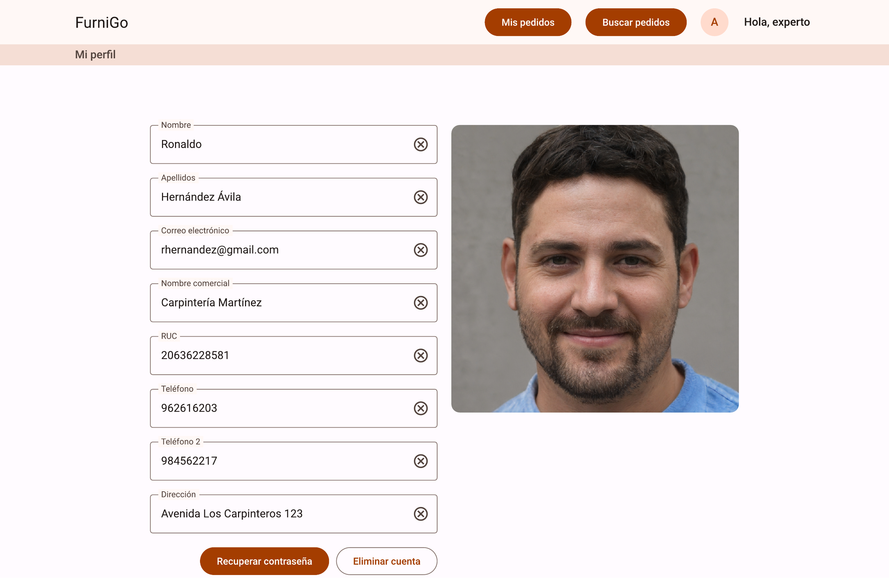
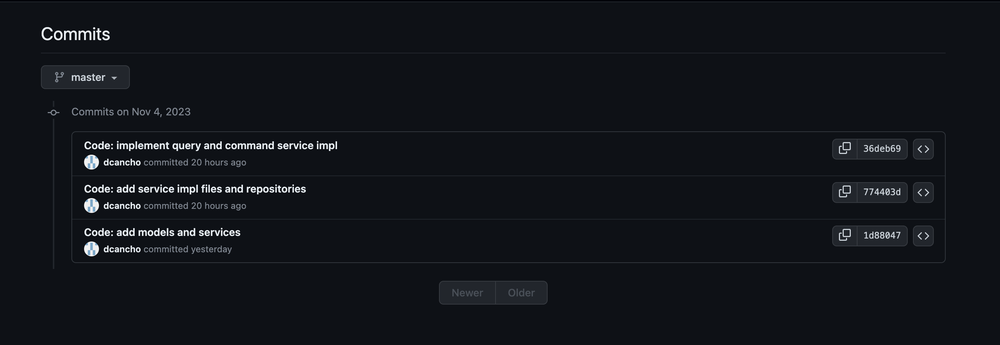

 </img> 

# Universidad Peruana de Ciencias Aplicadas  
## Ingeniería de Software - Ciclo V  
## Desarrollo de Aplicaciones Web  
## SV51  
## Profesor:  
Mori Paiva, Hugo Allan  
# Informe de Trabajo Final  
## SparkLabs  
## FurniGo  
## Profesor: 
Mori Paiva, Hugo Allan  

## Integrantes:  
- Cancho Coila, Diego Fabian U20201F479  
- Isla Quispe, Luis Fernando U202124146  
- Velarde Luyo, Piero Alberto U20211A620  
- Loli Ruiz, Renzo Javier U202161C993  
- Rondon Añaños, Cristopher U20201A291  

## Registro de versiones del informe  

| Fecha | Version | Autor | Descripción |
| :---: | :---: | :---: | :---: |
| 03/09/2023 | 0.1 | SparkLabs | Creación del documento |
| 10/09/2023 | 0.2 | SparkLabs | Se agregaron los capítulos para la entrega de TB1 |
| 30/09/2023 | 0.3 | SparkLabs | Se agregó el capítulo 5.2.2 correspondiente al Sprint 2 |

## Project Report Collaboration Insights  

## Contenido  
> ### Capitulo I: Introducción
> #### 1.1. Startup Profile
> ##### 1.1.1. Descripcion de la Startup
FurniGo nació como una solución innovadora para abordar las limitaciones y desafíos que enfrenta el proceso de adquisición de muebles. La carencia de precisión y comunicación en este proceso a menudo derivaba de la falta de herramientas digitales en la industria, lo que daba lugar a malentendidos en el diseño, ambigüedades y descontento con los productos finales. Además, el proceso tradicional requería una inversión considerable de tiempo por parte de los compradores, quienes tenían que visitar talleres de carpintería en persona, detallar sus requerimientos y esperar a que fueran comprendidos adecuadamente. Lo mismo aplicaba para los carpinteros, que debían interpretar descripciones detalladas, en su mayoría comunicadas verbalmente.  

Para abordar estos desafíos, surgió la concepción de FurniGo como una plataforma integral que beneficiaría tanto a quienes buscan muebles como a los artesanos carpinteros. Reconocimos la importancia de empoderar a ambos actores clave en este proceso: los clientes que diseñan los muebles y los talleres que los construyen. Nuestra solución proporciona un espacio donde los clientes pueden plasmar sus ideas de manera intuitiva, y almacenar y gestionar sus diseños. Al mismo tiempo, los carpinteros pueden acceder a información precisa proveniente de estos diseños, incluyendo la cantidad de piezas requeridas, dimensiones, materiales y colores.  

En esencia, nuestro propósito fundamental en FurniGo es mejorar la experiencia general en el proceso de adquisición de muebles, reduciendo el tiempo invertido y asegurando resultados satisfactorios. A través de una comunicación clara y una toma de decisiones informada, estamos comprometidos en transformar la manera en que las personas encuentran y obtienen muebles de alta calidad.  

> ##### 1.1.2. Perfiles de Integrantes del equipo

  

> #### 1.2. Solution Profile
> ##### 1.2.1. Antecedentes y problematica
Estamos en proceso de crear un producto que permitirá conectar directamente a aquellos clientes que buscan un diseño específico para sus muebles con talleres de carpintería capaces de fabricar sus pedidos de manera rápida, sencilla y segura.  

Como resultado de los desafíos que surgieron a raíz de la pandemia de COVID-19, nos vimos obligados a transformar nuestras rutinas y métodos de trabajo para adaptarnos a este nuevo panorama social. Con el objetivo de asegurarnos de que nadie quedara rezagado y brindar a los talleres de carpintería una oportunidad renovada para llegar a un público más amplio, decidimos abrazar la modalidad virtual.  

Como miembros del equipo de la startup FurniGo, nos hemos embarcado en la tarea de diseñar, desarrollar y administrar una plataforma web que aborde esta necesidad. En el transcurso de 2023, nuestro startup FurniGo lanzará una plataforma integral que atenderá todas las demandas de nuestros clientes.  

Para lograrlo, estamos realizando un estudio exhaustivo de nuestro público objetivo, teniendo en cuenta sus opiniones y sugerencias, procesando información y creando perfiles que nos servirán para definir las funcionalidades y la usabilidad de nuestra plataforma, con el objetivo de hacerla amigable y útil para los usuarios finales.  

> ###### 1.2.2.1. Lean UX Problem Statements
> ##### 1.2.2. Lean UX Process
Algunas personas tienen requisitos muy específicos cuando buscan diseñar un mueble a medida. Esto conlleva la necesidad de un servicio altamente personalizado, lo que los lleva a recurrir a talleres de carpintería. Sin embargo, en ocasiones, surgen desafíos en la comunicación que dificultan que el carpintero comprenda completamente el modelo o diseño que el cliente tiene en mente.

¿Cómo se puede mejorar la comunicación entre los clientes y los talleres para asegurar una comprensión precisa de los diseños que los clientes desean?

Observamos que hay personas interesadas en adquirir muebles, y esto nos brinda la oportunidad de conectar a estos compradores con talleres donde puedan comprar lo que necesitan. Sin embargo, hemos notado que algunas personas que están en busca de muebles sienten cierta desconfianza hacia los talleres cuando se trata de hacer una compra.

¿Cuál sería la mejor manera de fortalecer la confianza de los clientes en relación a los talleres?  

> ###### 1.2.2.2. Lean UX Assumptions
**SUPOSICIONES DE NEGOCIO:**

1\.	Creo que existe una demanda en el mercado de muebles personalizados, donde los clientes buscan una experiencia de compra rápida y segura.

2\.	Para abordar esta necesidad, planeo ofrecer una plataforma con características clave, como una función de búsqueda avanzada para encontrar talleres de muebles adecuados, un sistema de pago integrado en la aplicación y la capacidad de navegar por trabajos previos para inspiración.

3\.	Mis clientes iniciales incluirán tanto consumidores que deseen adquirir muebles personalizados como propietarios de talleres que deseen vender sus productos a través de la plataforma.

4\.	La principal propuesta de valor para los clientes será la seguridad y la facilidad de encontrar talleres de confianza, así como la rapidez en el proceso de compra de muebles personalizados.

5\.	También permitiré a los clientes evaluar y calificar los talleres con los que han trabajado, lo que proporcionará retroalimentación valiosa para otros compradores.

6\.	Planeo atraer a la mayoría de mis clientes a través de estrategias de marketing en redes sociales y campañas publicitarias dirigidas.

7\.	Generaré ingresos mediante un cargo adicional al momento de realizar la compra de muebles personalizados a través de la plataforma.

8\.	En el mercado, competiré principalmente con otros proveedores de muebles personalizados, aunque también tendré en cuenta competidores en el ámbito de muebles prefabricados.

9\.	Creo que nuestra ventaja competitiva radica en ofrecer a los clientes la posibilidad de diseñar sus propios muebles personalizados, lo que nos diferencia de la competencia.

10\.	Reconozco que uno de los mayores riesgos del producto es la posible falta de adopción inicial por parte de los usuarios y la complejidad percibida de la interfaz de la aplicación.

11\.	Planeo mitigar estos riesgos a través de una comunicación efectiva con nuestros usuarios, recopilando sus comentarios y realizando mejoras continuas en la interfaz y la experiencia del usuario.

12\.	Suposiciones Adicionales:

•	Anticipo una acogida inicial limitada, pero confío en que podremos retener a los usuarios a largo plazo mediante un servicio de alta calidad.

•	Creo que estamos ingresando a un mercado poco explotado, lo que nos brinda oportunidades de crecimiento significativas.  

**SUPOSICIONES DE USUARIO:**  

1\. ¿Quién es el usuario?

Personas que quieren comprar muebles y los dueños de talleres de carpintería

2\. ¿Dónde encaja nuestro producto en su trabajo o vida?

Tanto en actividades de su vida como trabajo

3\. ¿Qué problemas tiene nuestro producto y cómo se puede resolver?

Actualmente no se pueden encontrar talleres, esto se puede solucionar contactando y afiliando talleres.

4\. ¿Cuándo y cómo es usado nuestro producto?

Es usado cuando se quiere comprar un mueble y se usará a través de su dispositivo móvil mediante una aplicación.

5\. ¿Qué características son importantes?

Que sea fácil de instalar y utilizar, principalmente al momento de diseñar sus muebles.

6\. ¿Cómo debe verse nuestro producto y cómo debe comportarse?

Deberá mostrar muebles, además ser rápido y eficiente

> ###### 1.2.2.3. Lean UX Hypothesis Statements
Creemos que al permitir a los talleres registrar sus datos en la aplicación, les facilitará publicar sus servicios.

Sabremos que hemos tenido éxito

Cuando al menos un 30% de los talleres en Lima se registren.

Creemos que al permitir a los talleres registrar sus contactos, mejorará la comunicación con los usuarios.

Sabremos que hemos tenido éxito

Cuando la satisfacción de clientes y talleres aumente en un 10%.

Creemos que al implementar un sistema de valoraciones y reseñas sobre los servicios, ayudaremos a los usuarios a encontrar talleres ideales.

Sabremos que hemos tenido éxito

Cuando la satisfacción del cliente aumente en un 10%.

Creemos que al permitir a los talleres mostrar productos ya fabricados, aumentaremos sus ingresos.

Sabremos que hemos tenido éxito

Cuando la satisfacción de los talleres aumente en un 15%.

Creemos que al agregar la función de realizar pagos dentro de la aplicación, aumentará la confianza de los usuarios en nuestra plataforma.

Sabremos que hemos tenido éxito

Cuando el número de desinstalaciones de nuestra aplicación se reduzca en un 10%.

> ###### 1.2.2.4. Lean UX Canvas
<table><tr><th valign="top">
<b>Business Problem</b> 

Hemos observado que las personas que quieren adquirir muebles a medida tardan mucho tiempo encontrando talleres adecuados a sus necesidades y mucho más explicando el producto que quieren. 

Además, los talleres de carpintería tienen dificultades para expandir su clientela. 
</th><th rowspan="2" valign="top">
<b>Solution Ideas</b> 

- Una aplicación que ayude a los usuarios a encontrar el taller más adecuado para su diseño. 

- Una aplicación que permita al usuario diseñar sus propios muebles 

- Una aplicación donde el usuario pueda calificar el servicio de carpintería. 

- Una aplicación que le permita al taller de carpintería aumentar y controlar su afluencia de clientes y pedidos. 

- Una aplicación que le permita al taller de carpintería vender sus muebles prefabricados. 
</th><th valign="top">
<b>Business Outcomes</b> 

- Nuestros usuarios consiguen los muebles que quieren 

- Los talleres consiguen más clientes y por consecuencia más ingresos 

- Que al menos un 25% de usuarios conserven la aplicación 

</b>  
</th></tr>
<tr><td valign="top">
<b>Users & Customers</b> 

Clientes: Personas de 18 a 60 años que quieren comprar muebles para decorar sus hogares o para algún uso particular. 

Talleres: Talleres de carpintería que quieren publicitarse para aumentar sus clientes y sus ventas 
</td><td valign="top">
<b>User Benefits</b> 

- Reducir el tiempo que toma comprar un mueble. 

- Diseñar muebles de forma fácil e intuitiva, con una interfaz fácil de entender 

- La posibilidad de reseñar el servicio brindado y ver las recomendaciones de otros usuarios 

- Publicitar sus servicios para aumentar su alcance 
</td></tr>
<tr><td valign="top">
<i><b>Hypotheses</b></i> 

- Creemos que al registrar los datos del taller les permitirá publicar su taller en la aplicación 

- Sabremos que hemos tenido éxito 

- Cuando al menos un 30% de los talleres en Lima se registren 
</td><td valign="top">
<i><b>What's the most important thing we need to learn first?</b></i> 

- Conocer los distintos talleres de carpintería en Lima y el proceso de construcción de un mueble 

- Conocer los patrones de conducta de las personas que compran muebles o están interesadas en comprar muebles. 
</td><td valign="top">
<i><b>What's the least amount of work we need to do to learn the next most important thing?</b></i> 

- Entrevistas a las personas que compran muebles de forma regular 

- Contactar dueños de talleres de carpintería 
</td></tr>
</table>  

> #### 1.3. Segmentos Objetivos
Nuestra aplicación tiene dos segmentos objetivos, listados a continuación:  

\- Clientes:  

`  `Estos son personas naturales que desean adquirir muebles hechos a pedido. Tienen en mente el diseño de dicho mobiliario y lo tienen plasmado en un esquema o plano o, preferentemente, pueden utilizar un programa de modelado como SketchUp para generar un modelo 3D de dicho mueble.

\- Carpinteros/Ebanistas:  

`  `Son personas (o talleres) con experiencia y los medios y recursos necesarios para poder fabricar muebles a pedido a partir de un plano esquemático y/o modelos 3D. Buscan nuevas formas de ofrecer sus servicios, tales como el uso de plataformas web que les permita ofrecer presupuestos a potenciales clientes que tienen un diseño de mueble en mente.
> ### Capitulo II: Requirements Elicitation & Analysis
> #### 2.1. Competidores
> ##### 2.1.1. Analisis Competitivo
<table style="undefined;table-layout: fixed; width: 903px">
<colgroup>
<col style="width: 72.2px">
<col style="width: 146.2px">
<col style="width: 171.2px">
<col style="width: 171.2px">
<col style="width: 171.2px">
<col style="width: 171.2px">
</colgroup>
<thead>
  <tr>
    <th colspan="6">Competitive Analysis Landscape</th>
  </tr>
</thead>
<tbody>
  <tr>
    <td colspan="2" rowspan="2">¿Por qué llevar a cabo este análisis?</td>
    <td colspan="4">¿Cuáles son las fortalezas y debilidades de nuestros competidores? ¿Cuáles son nuestras fortalezas y debilidades en comparación con nuestros competidores? ¿Existen oportunidades para diferenciarnos de nuestros competidores y cómo podemos aprovecharlas?</td>
  </tr>
  <tr>
    <td colspan="4">Nos diferenciaremos de la comptencia ofreciendo al cliente la oportunidad de conseguir muebles mucho más personalizados, puesto que ellos pueden enviar sus diseños a varios carpinteros, ebanistas y tapiceros para que evalúen la propuesta y envíen una proforma y fecha.</td>
  </tr>
  <tr>
    <td colspan="2">Competidores</td>
    <td>FurniGo</td>
    <td>Promart</td>
    <td>Sodimac</td>
    <td>Saga Falabella</td>
  </tr>
  <tr>
    <td rowspan="2">Perfil</td>
    <td>Overview</td>
    <td>Plataforma de comercio especializada en la manufactura de muebles a pedido con diseños personalizados, llevados a cabo por carpinteros y talleres especializados. </td>
    <td>Tienda de mejoramiento del hogar. Vende, entre otros, mobiliario de diferentes materiales y diseños. Cuenta con servicio de envío a domicilio y opciones de financiamiento a través de Financiera Oh!.</td>
    <td>Tienda de mejoramiento del hogar. En su división Homecenter, en contraste a Constructor, vende artículos para el hogar y muebles en diferentes materiales y diseños. Cuenta con servicio de envío a domicilio y financiamiento con Banco Falabella. </td>
    <td>Tienda de ventas por departamento. En la sección de hogar, vende muebles y juegos completos para diferentes ambientes. Cuenta con servicio de envío a domicilio y financiamiento con Banco Falabella.</td>
  </tr>
  <tr>
    <td>Ventaja competitiva ¿Qué valor ofrece al cliente?</td>
    <td>Brinda al usuario comprador la posibilidad de hallar múltiples ofertas y cotizaciones para los muebles que tiene en mente con solo presentar su diseño en plano o modelo 3D.</td>
    <td colspan="3">Cuentan con muchos locales alrededor del Perú, una página web y un amplio catálogo de opciones accesibles, además de contar con delivery a todo Lima y, ocasionalmente, a zonas aledañas a tiendas en provincia.</td>
  </tr>
  <tr>
    <td rowspan="2">Perfil de marketing</td>
    <td>Mercado objetivo</td>
    <td>Personas de 18 a 60 años que desean adquirir mobiliario con diseño personalizado de manera conveniente.
Carpinteros/Talleres: Profesionales que desean utilizar medios digitales para ampliar su alcance y aumentar sus ganancias.
</td>
    <td colspan="3">El mercado objetivo de las tres tiendas son personas de entre 18 y 60 años que desean adquirir diferentes productos para su uso o mejora/decoración del hogar.</td>
  </tr>
  <tr>
    <td>Estrategias de marketing</td>
    <td>Dar a los talleres carpinteros la oportunidad de fabricar piezas únicas para potenciales clientes que desean tener un mueble único.</td>
    <td>Brindamos soluciones integrales con productos especializados para cada sector </td>
    <td>El objetivo de Sodimac en marketing es convertirse como marca en el mejor socio para los especialistas de la construcción, acompañándolos en el camino del progreso y crecimiento y ayudándolos a llevar a cabo sus obras del mejor modo.</td>
    <td>Ha implementado el marketing on-line utilizando las diferentes estrategias y tácticas del mismo, para expandir su mercado, captar nuevos clientes, lograr un mayor posicionamiento y promover sus productos y/o servicios; por consiguiente, generar más ventas.</td>
  </tr>
  <tr>
    <td rowspan="4">Perfil del producto</td>
    <td>Productos y servicios</td>
    <td>Plataforma web especializada orientada a conectar clientes compradores y talleres de carpintería. </td>
    <td>Tiendas físicas y virtual para la adquisición de productos para el mejoramiento del hogar o construcción.
</td>
    <td>Tiendas físicas y virtual para la adquisición de productos para el mejoramiento del hogar o construcción.
</td>
    <td>Tiendas físicas y virtual para la adquisición de artículos de moda, belleza, electrodomésticos y mobiliario para el hogar.
</td>
  </tr>
  <tr>
    <td>Precios y costos</td>
    <td>Cobro de comisión a los talleres por orden de trabajo.</td>
    <td colspan="3">Dependen del artículo comprado.</td>
  </tr>
  <tr>
    <td>Canales de distribución</td>
    <td>Web</td>
    <td>Tiendas físicas y web</td>
    <td>Tiendas físicas y web</td>
    <td>Tiendas físicas y web</td>
  </tr>
  <tr>
    <td>Tecnologías usadas</td>
    <td>Java, HTML, CSS, Angular.js Typescript flavoured, HTTPS</td>
    <td>Kotlin/Swift</td>
    <td>Kotlin/Swift</td>
    <td>Kotlin/Swift</td>
  </tr>
  <tr>
    <td rowspan="4">Análisis SWOT</td>
    <td>Fortalezas</td>
    <td></td>
    <td></td>
    <td></td>
    <td></td>
  </tr>
  <tr>
    <td>Debilidades</td>
    <td></td>
    <td></td>
    <td></td>
    <td></td>
  </tr>
  <tr>
    <td>Oportunidades</td>
    <td></td>
    <td></td>
    <td></td>
    <td></td>
  </tr>
  <tr>
    <td>Amenazas</td>
    <td>Competidores con mucha más experiencia</td>
    <td></td>
    <td></td>
    <td>Competencia más especializada. Sodimac es incluso una empresa de la misma matriz.</td>
  </tr>
</tbody>
</table>  

> ##### 2.1.2. Estrategias y tacticas frente a competidores
**Estrategias:**  
**Desarrollo de una plataforma de prototipos virtuales**: Crearemos una plataforma en línea donde los diseñadores puedan visualizar sus prototipos de manera virtual. Esto les permitirá mostrar sus diseños de manera realista y atractiva, sin necesidad de fabricar los productos físicamente.  
**Enfocaremos nuestros esfuerzos en la personalización y la exclusividad**: Destacaremos la posibilidad de obtener productos únicos y personalizados a través de nuestra plataforma. Aprovecharemos la tendencia actual hacia lo exclusivo y lo personalizado, atrayendo a los consumidores que buscan artículos distintivos para sus hogares.  

**Tácticas**:  
**Implementación de una estrategia de marketing de contenidos**: Adicionalmente a prestar el servicio de conectar a los clientes y fabricantes, incluiremos la posibilidad de poder compartir resultados de los muebles fabricados a través de nuestro servicio, lo cual ayuda a respaldar la experiencia y calidad del trabajo de los carpinteros y talleres.  
**Ofreceremos una experiencia de usuario excepcional**: Garantizaremos que nuestra plataforma sea fácil de usar y brinde una experiencia de usuario excepcional. Destacaremos la navegación intuitiva, la visualización en 3D y las opciones de personalización para atraer y retener a los usuarios.  
**Identificaremos nichos específicos en el mercado**: Reconoceremos segmentos no atendidos por las grandes marcas en el mercado de decoración para el hogar. Nos enfocaremos en estilos particulares, como el minimalismo, el vintage o lo étnico, buscando incluir talleres dispuestos a incursionar en estos estilos.  
**Recopilaremos retroalimentación constante**: Estableceremos un sistema para captar comentarios y sugerencias de talleres y clientes. Utilizaremos esta información para mejorar continuamente nuestra plataforma y los servicios que brindamos.  

> #### 2.2. Entrevistas  
> ##### 2.2.1. Diseño de entrevistas
**Estructura de la entrevista**:  
- Saludo inicial  
- Preguntas del segmento correspondiente  
- Explicación de la aplicación de forma relevante a su segmento.  
- Preguntas sobre el proyecto  
- Preguntas y autovaloración sobre habilidades digitales  

**Lista de preguntas:**  

*Preguntas introductorias:* 
 
Segmento cliente persona:  
- ¿Cuál es su nombre?
- ¿Edad?
- ¿Cuál es su ocupación? ¿Estudia o trabaja?
- ¿Se consideraría creativo o sensible?
- ¿Con qué regularidad hace compras por internet?
- ¿Cuál es el tipo de artículos que suele comprar?
- Por lo general, ¿cómo adquiere un mueble? ¿Tiene alguna tienda preferida?
- ¿Alguna vez ha comprado mobiliario a través de internet? De ser así, ¿puede comentarme alguna experiencia?
- ¿Alguna vez se ha frustrado por no encontrar los muebles con el diseño o estilo que deseaba?
- ¿Le agradaría la posibilidad de poder crear sus propios diseños? Si es así, ¿cree que sería capaz de plasmar los diseños en planos que detallen medidas, material, colores? ¿Sería práctico para usted?
- ¿Conoce alguna aplicación de diseño que pueda servir para este propósito?
Preguntas sobre el proyecto:
- ¿Qué opina sobre nuestra aplicación? ¿Considera que podría ser útil?
- ¿Cree que sería práctico el uso de esta o es muy complejo para su propósito?
- ¿Le agradaría la idea de realizar los pagos a través de la aplicación?
- ¿Qué funcionalidades propondría para la aplicación?
- ¿Pagaría usted por el uso de la aplicación? ¿Cuánto?  

Segmento carpintero/taller de carpintería:
- ¿Cuál es su nombre?
- ¿Edad?
- Respecto a su trabajo de carpintero, ¿tuvo algún tipo de formación profesional, fue aprendiz o es autodidacta?
- Respecto a su taller, ¿solo usted trabaja en él o tiene otros colaboradores?
- ¿Cuántos pedidos suele tener por mes? ¿Me podría detallar un poco de ellos? Tal vez son juegos completos de sala, reparaciones de muebles, etc.
- ¿Simultáneamente cuantos pedidos avanza? ¿Se dedica completamente a uno, los reparte con sus colaboradores o de qué forma se organiza?
- ¿Alguna vez un cliente le llevó un plano o modelo 3D sobre el mueble que deseaba? ¿Cómo fue la experiencia? ¿Fue fácil de comprender?
- ¿Cree usted poder comprender como fabricar un mueble a partir de un modelo 3D?
o	De ser posible, presentar un modelo 3D al carpintero e interactuar para determinar si lo entendió o no. Apuntar qué detalles requiere para la fabricación.
- ¿Publicita su trabajo en redes sociales o prefiere las recomendaciones por sus mismos clientes?
- ¿Usted, o alguien en el taller, también hace diseños para los muebles? ¿Con qué frecuencia?
- Al momento de realizar el diseño, ¿utiliza algún tipo de software para hacerlo o depende completamente de planos o maquetas?
- ¿Le es atractiva la idea de contar con una herramienta digital para este fin?
- ¿Le interesaría una aplicación que le ayude en la búsqueda de clientes?  

*Preguntas sobre el proyecto:*
- ¿Qué opina de nuestra aplicación? ¿Considera que le sería útil?
- ¿Considera que es práctica para su fin?
- ¿Conoce alguna herramienta similar a esta? ¿La usa o conoce algún otro taller que la use?
- ¿Considera que nuestra aplicación puede aumentar sus ventas e ingresos?
- ¿Qué funcionalidades considera usted importantes para la aplicación?
Preguntas sobre competencia de herramientas digitales:
En una escala del 1 al 10:
- ¿Cómo se califica con el uso de los smartphones y/o tablets?
- ¿Cómo se califica con el uso de laptops y computadoras?
- ¿Cómo se califica con el uso de navegadores de internet?
- ¿Cómo se califica con el uso de aplicaciones móviles? ¿Y de escritorio?
- ¿Qué herramientas de diseño conoce? ¿Cómo se califica con su uso?
- Para el uso de la aplicación y diseño de los muebles, ¿podría usted aprender a utilizar la aplicación o se vuelve una tarea muy compleja?
> #### 2.3. Needfinding
> ##### 2.3.1. User Personas
  
  

> ##### 2.3.2. User Task Matrix
<table style="undefined;table-layout: fixed; width: 550px">
<tbody>
<tr>
    <td rowspan="2">Task Matrix</td>
    <td colspan="2">Cliente</td>
    <td colspan="2">Carpintero</td>
  </tr>
  <tr>
    <td>Frecuencia</td>
    <td>Importancia</td>
    <td>Frecuencia</td>
    <td>Importancia</td>
  </tr>
  <tr>
    <td>Buscar información de talleres de carpintería confiables</td>
    <td>Media</td>
    <td>Alta</td>
    <td>-</td>
    <td>-</td>
  </tr>
  <tr>
    <td>Buscar modelos de muebles en internet</td>
    <td>Media</td>
    <td>Alta</td>
    <td>Alta</td>
    <td>Alta</td>
  </tr>
  <tr>
    <td>Realizar un bosquejo de lo que de lo que deseo</td>
    <td>Media</td>
    <td>Alta</td>
    <td>-</td>
    <td>-</td>
  </tr>
  <tr>
    <td>Investigar qué materiales me convienen para mi mueble</td>
    <td>Media</td>
    <td>Alta</td>
    <td>Baja</td>
    <td>Alta</td>
  </tr>
  <tr>
    <td>Contactar a algún taller que pueda realizar lo que deseo</td>
    <td>Alta</td>
    <td>Alta</td>
    <td>-</td>
    <td>-</td>
  </tr>
  <tr>
    <td>Acordar tiempo de entrega del mueble</td>
    <td>Media</td>
    <td>Alta</td>
    <td>Media</td>
    <td>Alta</td>
  </tr>
  <tr>
    <td>Reunirse para afinar detalles</td>
    <td>Media</td>
    <td>Alta</td>
    <td>Media</td>
    <td>Alta</td>
  </tr>
  <tr>
    <td>Definir un presupuesto</td>
    <td>Media</td>
    <td>Alta</td>
    <td>Media</td>
    <td>Alta</td>
  </tr>
  <tr>
    <td>Comprar materiales</td>
    <td>-</td>
    <td>-</td>
    <td>Alta</td>
    <td>Alta</td>
  </tr>
  <tr>
    <td>Realizar medidas</td>
    <td>-</td>
    <td>-</td>
    <td>Alta</td>
    <td>Alta</td>
  </tr>
  <tr>
    <td>Construir las partes del mueble</td>
    <td>-</td>
    <td>-</td>
    <td>Alta</td>
    <td>Alta</td>
  </tr>
  <tr>
    <td>Armar el mueble</td>
    <td>-</td>
    <td>-</td>
    <td>Alta</td>
    <td>Alta</td>
  </tr>
  <tr>
    <td>Afinar detalles del mueble</td>
    <td>Baja</td>
    <td>Alta</td>
    <td>Media</td>
    <td>Alta</td>
  </tr>
  <tr>
    <td>Entrega del mueble terminado</td>
    <td>Media</td>
    <td>Alta</td>
    <td>Alta</td>
    <td>Alta</td>
  </tr>
  </tbody>
</table>  

> ##### 2.3.4. Empathy Mapping
### Segmento Cliente
  

### Segmento Carpintero
  

> ##### 2.3.5. As-is Scenario Mapping
  

  

> ### Capitulo III: Requirements Specification
> #### 3.1. To-Be Scenario Mapping
+ 
+ 
  
> #### 3.2. User Stories

<table  border="2" cellpadding="1" bordercolor="#3253dd">
    <tbody>
        <tr>
            <td rowspan=1 align="center">HU:</td>
            <td rowspan=1 align="center">183309401</td>
            <td align="center">Título:</td>
            <td align="center">Eliminar tarjeta</td>
        </tr>
        <tr>
            <td rowspan=1 align="center">Usuario:</td>
            <td rowspan=1 align="center">Cliente</td>
            <td align="center">Sprint:</td>
            <td align="center">2</td>
        </tr>
        <tr>
            <td colspan=1 align="center">Descripción</td>
            <td colspan=3 align="justify">Como usuario Cliente quiero poder eliminar una tarjeta que he registrado
        </tr>
        <tr>
            <td colspan=1 align="center">Criterios de Aceptación</td>
            <td colspan=3 align="justify"> <b>Sceniario 1: Eliminar tarjeta adrede. </b> 
             
            <b>Dado que </b> el usuario seleccione una tarjeta registrada 
             
            <b>Cuando </b> el usuario presione el botón de eliminar y confirme en el mensaje de verificación
             
            <b>Entonces</b> aparecerá un mensaje confirmando la eliminación de la tarjeta
              
            <b>Scenario 2: Eliminar tarjeta por error. </b> 
             
            <b>Dado que </b> el usuario seleccione una tarjeta registrada
             
            <b>Cuando </b> el usuario presione el botón de eliminar y rechace en el mensaje de verificación
             
            <b>Entonces</b> volverá al apartado de mis tarjetas.
            </td>            
        </tr>
        <tr>
            <td colspan=1 align="center">Prioridad</td>
            <td colspan=3 align="center">Alta</td>
        </tr>
        <tr>
            <td colspan=1 align="center">Puntos de Historia</td>
            <td colspan=3 align="center">5 puntos</td>
        </tr>
    </tbody>
</table>

<table  border="2" cellpadding="1" bordercolor="#3253dd">
    <tbody>
        <tr>
            <td rowspan=1 align="center">HU:</td>
            <td rowspan=1 align="center">183309402</td>
            <td align="center">Título:</td>
            <td align="center">Agregar Cuenta Bancaria</td>
        </tr>
        <tr>
            <td rowspan=1 align="center">Usuario:</td>
            <td rowspan=1 align="center">Taller</td>
            <td align="center">Sprint:</td>
            <td align="center">2</td>
        </tr>
        <tr>
            <td colspan=1 align="center">Descripción</td>
            <td colspan=3 align="justify">Como usuario Taller quiero poder agregar una cuenta bancaria para poder recibir los pagos
        </tr>
        <tr>
            <td colspan=1 align="center">Criterios de Aceptación</td>
            <td colspan=3 align="justify"> <b>Scenario 1: Cuenta correcta.</b> 
             
            <b>Dado que </b> el usuario taller seleccione “Agregar cuenta” en la sección de “Mis cuentas” y llene los campos correctamente.
             
            <b>Cuando </b> el usuario presione el botón de “Añadir”
             
            <b>Entonces</b> aparecerá un mensaje confirmando la agregación de la cuenta.
              
            <b>Scenario 2: Cuenta incorrecta. </b> 
             
            <b>Dado que </b> el usuario taller seleccione “Agregar cuenta” en la sección de “Mis cuentas” y llene los campos incorrectamente.
             
            <b>Cuando </b> el usuario presione el botón de “Añadir”
             
            <b>Entonces</b> aparecerá un mensaje indicando un error en alguno de los campos llenados.
            </td>
        </tr>
        <tr>
            <td colspan=1 align="center">Prioridad</td>
            <td colspan=3 align="center">Alta</td>
        </tr>
        <tr>
            <td colspan=1 align="center">Puntos de Historia</td>
            <td colspan=3 align="center">5 puntos</td>
        </tr>
    </tbody>
</table>

<table  border="2" cellpadding="1" bordercolor="#3253dd">
    <tbody>
        <tr>
            <td rowspan=1 align="center">HU:</td>
            <td rowspan=1 align="center">183309403</td>
            <td align="center">Título:</td>
            <td align="center">Eliminar Cuenta Bancaria</td>
        </tr>
        <tr>
            <td rowspan=1 align="center">Usuario:</td>
            <td rowspan=1 align="center">Taller</td>
            <td align="center">Sprint:</td>
            <td align="center">2</td>
        </tr>
        <tr>
            <td colspan=1 align="center">Descripción</td>
            <td colspan=3 align="justify">Como usuario Taller quiero poder eliminar una cuenta bancaria.
        </tr>
        <tr>
            <td colspan=1 align="center">Criterios de Aceptación</td>
            <td colspan=3 align="justify"> <b>Scenario 1: Eliminar Cuenta adrede.</b> 
             
            <b>Dado que </b> el usuario taller seleccione esté en la sección de “Mis cuentas” y seleccione una cuenta para eliminarla.
             
            <b>Cuando </b> el usuario presione el botón de “Eliminar” y confirme su operación.
             
            <b>Entonces</b> aparecerá un mensaje confirmando la eliminación de la cuenta.
              
            <b>Scenario 2: Eliminar Cuenta por error. </b> 
             
            <b>Dado que </b> el usuario taller seleccione esté en la sección de “Mis cuentas” y seleccione una cuenta para eliminarla.
             
            <b>Cuando </b> el usuario presione el botón de “Eliminar” y rechace su operación.
             
            <b>Entonces</b> se retornará a la sección de “Mis cuentas”.
            </td>    
        </tr>
        <tr>
            <td colspan=1 align="center">Prioridad</td>
            <td colspan=3 align="center">Alta</td>
        </tr>
        <tr>
            <td colspan=1 align="center">Puntos de Historia</td>
            <td colspan=3 align="center">5 puntos</td>
        </tr>
    </tbody>
</table>

<table  border="2" cellpadding="1" bordercolor="#3253dd">
    <tbody>
        <tr>
            <td rowspan=1 align="center">HU:</td>
            <td rowspan=1 align="center">183309404</td>
            <td align="center">Título:</td>
            <td align="center">Ingresar costo de mueble</td>
        </tr>
        <tr>
            <td rowspan=1 align="center">Usuario:</td>
            <td rowspan=1 align="center">Taller</td>
            <td align="center">Sprint:</td>
            <td align="center">2</td>
        </tr>
        <tr>
            <td colspan=1 align="center">Descripción</td>
            <td colspan=3 align="justify">Como usuario Taller quiero poder ingresar el precio que cobraré por un mueble.
        </tr>
        <tr>
            <td colspan=1 align="center">Criterios de Aceptación</td>
            <td colspan=3 align="justify"> <b>Scenario 1: Ingresar un monto correcto.</b> 
             
            <b>Dado que </b> el usuario taller seleccione un mueble a cotizar.
             
            <b>Cuando </b> el usuario presione el botón de “Cotizar” e ingrese un monto de 5 cifras como máximo.
             
            <b>Entonces</b> aparecerá un mensaje confirmando el registro de la cotización.
              
            <b>Scenario 2: Ingresar un monto incorrecto. </b> 
             
            <b>Dado que </b> el usuario taller seleccione un mueble a cotizar.
             
            <b>Cuando </b> el usuario presione el botón de “Cotizar” e ingrese un monto superando el máximo de cifras permitido.
             
            <b>Entonces</b> aparecerá un mensaje indicando un error en el monto registrado en la cotización.
            </td>    
        </tr>
        <tr>
            <td colspan=1 align="center">Prioridad</td>
            <td colspan=3 align="center">Alta</td>
        </tr>
        <tr>
            <td colspan=1 align="center">Puntos de Historia</td>
            <td colspan=3 align="center">5 puntos</td>
        </tr>
    </tbody>
</table>

<table  border="2" cellpadding="1" bordercolor="#3253dd">
    <tbody>
        <tr>
            <td rowspan=1 align="center">HU:</td>
            <td rowspan=1 align="center">183309405</td>
            <td align="center">Título:</td>
            <td align="center">Filtrar pedidos pendientes.</td>
        </tr>
        <tr>
            <td rowspan=1 align="center">Usuario:</td>
            <td rowspan=1 align="center">Taller</td>
            <td align="center">Sprint:</td>
            <td align="center">2</td>
        </tr>
        <tr>
            <td colspan=1 align="center">Descripción</td>
            <td colspan=3 align="justify">Como usuario Taller quiero poder filtrar según fecha de entrega, monto y nombre de cliente los pedidos que tengo pendientes.
        </tr>
        <tr>
            <td colspan=1 align="center">Criterios de Aceptación</td>
            <td colspan=3 align="justify"> <b>Scenario 1: Existen pedidos pendientes.</b> 
             
            <b>Dado que </b> el usuario taller esté en la sección de “Pedidos Pendientes”.
             
            <b>Cuando </b> seleccione un filtro de los existentes.
             
            <b>Entonces</b> aparecerán los/el registro(s) que cumpla con el filtro seleccionado.
              
            <b>Scenario 2: No existen pedidos pendientes. </b> 
             
            <b>Dado que </b> el usuario taller esté en la sección de “Pedidos Pendientes”.
             
            <b>Cuando </b> seleccione un filtro de los existentes.
             
            <b>Entonces</b> no aparecerán los/el registro(s) debido a que no existen.
            </td>    
        </tr>
        <tr>
            <td colspan=1 align="center">Prioridad</td>
            <td colspan=3 align="center">Media</td>
        </tr>
        <tr>
            <td colspan=1 align="center">Puntos de Historia</td>
            <td colspan=3 align="center">3 puntos</td>
        </tr>
    </tbody>
</table>

<table  border="2" cellpadding="1" bordercolor="#3253dd">
    <tbody>
        <tr>
            <td rowspan=1 align="center">HU:</td>
            <td rowspan=1 align="center">183309406</td>
            <td align="center">Título:</td>
            <td align="center">Visualizar historial de pedidos completados.</td>
        </tr>
        <tr>
            <td rowspan=1 align="center">Usuario:</td>
            <td rowspan=1 align="center">Taller</td>
            <td align="center">Sprint:</td>
            <td align="center">2</td>
        </tr>
        <tr>
            <td colspan=1 align="center">Descripción</td>
            <td colspan=3 align="justify">Como usuario Taller quiero poder visualizar el historial de pedidos que he completado.
        </tr>
        <tr>
            <td colspan=1 align="center">Criterios de Aceptación</td>
            <td colspan=3 align="justify"> <b>Scenario 1: Existen pedidos completados.</b> 
             
            <b>Dado que </b> el usuario taller esté en la sección de “Inicio”.
             
            <b>Cuando </b> el usuario seleccione el apartado de “Pedidos Completados”.
             
            <b>Entonces</b> aparecerán los/el registro(s) que el usuario taller haya realizado.
              
            <b>Scenario 2: No existen pedidos completados. </b> 
             
            <b>Dado que </b> el usuario taller esté en la sección de “Inicio”.
             
            <b>Cuando </b> el usuario seleccione el apartado de “Pedidos Completados”.
             
            <b>Entonces</b> no aparecerán los/el registro(s) que el usuario taller haya realizado debido a que no existen tales registros.
            </td>    
        </tr>
        <tr>
            <td colspan=1 align="center">Prioridad</td>
            <td colspan=3 align="center">Media</td>
        </tr>
        <tr>
            <td colspan=1 align="center">Puntos de Historia</td>
            <td colspan=3 align="center">3 puntos</td>
        </tr>
    </tbody>
</table>

<table  border="2" cellpadding="1" bordercolor="#3253dd">
    <tbody>
        <tr>
            <td rowspan=1 align="center">HU:</td>
            <td rowspan=1 align="center">183309407</td>
            <td align="center">Título:</td>
            <td align="center">Filtrar historial de pedidos completados.</td>
        </tr>
        <tr>
            <td rowspan=1 align="center">Usuario:</td>
            <td rowspan=1 align="center">Taller</td>
            <td align="center">Sprint:</td>
            <td align="center">2</td>
        </tr>
        <tr>
            <td colspan=1 align="center">Descripción</td>
            <td colspan=3 align="justify">Como usuario Taller quiero poder filtrar el historial de pedidos que he completado.
        </tr>
        <tr>
            <td colspan=1 align="center">Criterios de Aceptación</td>
            <td colspan=3 align="justify"> <b>Scenario 1: Existen pedidos completados.</b> 
             
            <b>Dado que </b> el usuario taller esté en la sección de “Inicio”.
             
            <b>Cuando </b> el usuario seleccione el apartado de “Pedidos Completados” y seleccione alguno de los filtros existentes.
             
            <b>Entonces</b> aparecerán los/el registro(s) filtrados que el usuario taller haya realizado.
              
            <b>Scenario 2: No existen pedidos completados. </b> 
             
            <b>Dado que </b> el usuario taller esté en la sección de “Inicio”.
             
            <b>Cuando </b> el usuario seleccione el apartado de “Pedidos Completados” y seleccione alguno de los filtros existentes
             
            <b>Entonces</b> no aparecerán los/el registro(s) que el usuario taller haya realizado debido a que no existen registros completados.
            </td>    
        </tr>
        <tr>
            <td colspan=1 align="center">Prioridad</td>
            <td colspan=3 align="center">Media</td>
        </tr>
        <tr>
            <td colspan=1 align="center">Puntos de Historia</td>
            <td colspan=3 align="center">3 puntos</td>
        </tr>
    </tbody>
</table>  

> #### 3.3. Impact Mapping
+ 
  
> #### 3.4. Product Backlog
> ### Capitulo IV: Product  Design
> #### 4.1. Style Guidelines 
> ##### 4.1.1 General Style Guidelines
Se usaran botones para la navegacion entre frames. Cada frame tendra un boton principal para volver al menu principal segun si es cliente o experto.  
> ##### 4.1.2. Web Style Guidelines
Header simple con redireccion al principal.  
Seccion main donde ocurriran todos los eventos principales.  
Barra lateral en el main para seleccionar los datos visualizables.  
Botones crud para actualizar y eliminar.  

> #### 4.2. Information Architecture
> ##### 4.2.1. Organization Systems
Como equipo, hemos optado por implementar una estructura visual organizativa en la presentación de contenido para una organización, conocida como "Jerarquía Visual". Esta elección se basa en el hecho de que una jerarquía visual bien definida dirige la atención de los usuarios hacia los elementos más relevantes en una página o aplicación. La jerarquía visual de la página desempeña un papel crucial en la manera en que se presenta la información del sistema al usuario final, permitiéndoles identificar de manera instantánea dónde deben enfocar su atención al realizar un vistazo rápido a la página o la aplicación.  
Para lograr esta jerarquía visual, utilizamos el color y el contraste como herramientas clave. Esto se debe a que la aplicación selectiva de colores a un diseño tiene el efecto de atraer nuestra atención y determina la importancia que asignamos a distintos elementos en el diseño de un sitio web.  

> ##### 4.2.2. Labeling Systems
Cuando abordamos el diseño de nuestro sistema de etiquetado, nos sumergimos en el estudio de las etiquetas utilizadas por nuestros competidores, quienes, es importante destacar, son competidores indirectos. Nuestra intención era identificar las etiquetas más relevantes y comunes que se emplean en plataformas similares para simplificar su comprensión. Esto se hizo con el objetivo de evitar cualquier confusión o sobrecarga de información para nuestros clientes, evitando la ambigüedad.  
Nos enfocamos en las necesidades de nuestros consumidores y en consonancia con la propuesta de nuestro producto, buscamos proporcionar una experiencia fácil y amigable. Nuestro objetivo era que la mayoría de las personas pudiera utilizar nuestro producto de manera intuitiva y navegar sin dificultades a través de la plataforma.  

> ##### 4.2.3. SEO Tags and Meta Tags
En relación al SEO y las Meta Etiquetas, hemos decidido emplear el nombre de nuestra nueva empresa, FurniGo, como la etiqueta de título (Title Tag). Además, en la Meta Etiqueta, proporcionamos una descripción de los beneficios que nuestro servicio puede ofrecer a los usuarios. También utilizamos etiquetas meta de robots para indicar a los motores de búsqueda cómo deben interactuar con esa página en particular.  

> ##### 4.2.4. Searching Systems
Con el fin de lograr un posicionamiento eficaz de nuestra aplicación web y la página de inicio (Landing Page), planeamos incorporar palabras clave en las diversas secciones de ambas, específicamente en los selectores de tipo H en el código HTML, además de aprovechar la información de metadatos ya existente.  
En la aplicación web, específicamente en la sección de 'Mis Pedidos', estamos considerando implementar una función de búsqueda que permitirá a los usuarios buscar según varios criterios, como la fecha, el nombre del taller o una búsqueda específica. De esta manera, planeamos indexar estos contenidos por separado para optimizar su rendimiento en las búsquedas.  

> ##### 4.2.5. Navigation Systems
Hemos optado por incorporar un componente denominado 'Breadcrumb' (migas de pan) para facilitar la navegación de los usuarios. Este componente tiene la utilidad de informar al usuario acerca de la ubicación actual de la página que está visitando, así como las páginas previas que exploró para llegar a la pantalla actual.  
En nuestro diseño de 'Breadcrumb', hemos observado que la página actual no se presenta como seleccionable y se diferencia del resto mediante un color distinto.  

> #### 4.3. Landing Page UI Design
Nos enfocamos en una UI simple pero bien enfocada a darle toda la informacion al usuario de lo que obtendra en nuestra aplicacion web.  

> ##### 4.3.1. Landing Page Wireframe
El landing page sera simple y enfocara a ambos miembros (cliente y experto) a encontrar facilmente sus necesidades.  

  
  

> ##### 4.3.2. Landing Page Mock-up

  

> #### 4.4. Web Applications UX/UI Design
La aplicacion sera similar entre el cliente y experto pero tendra todo lo necesario para cada uno.  
> ##### 4.4.1. Web Application Wireframes
El cliente y el experto tendran tres secciones en las que podran:  
1. Cliente: Ver modelos con la lista de expertos que aceptan y sus perfiles, Añadir un nuevo modelo y Ver/Actualizar perfil.  
2. Experto: Explorar modelos, Ver modelos aceptados y Ver/Actualizar perfil.  

**Client wireframes:**

**Expert Wireframes:**

  

> ##### 4.4.2. Web Application Wireflow Diagrams
Los usuarios tendran a su dispocicion botones para navegar entre las diferentes secciones de la applicacion luego de iniciar sesion o registrarse.

**Expert Wireflow Diagrams:**  
  
  
  
  
  

**Client Wireflow Diagrams:**  
  
  
  
  
  
  

> ##### 4.4.3. Web Application Mock-ups
**Client Mockups:**

**Expert Mockups**

 

> ##### 4.4.4. Web Application User Flow Diagrams
**Expert User Flow Diagrams:**  
  

**Client User Flow Diagrams:**  
  

> #### 4.5. Web Applications Prototyping
Enlace del prototyping del landing page: [Prototyping](https://upcedupe-my.sharepoint.com/:f:/g/personal/u20161c993_upc_edu_pe/EuEouMKP5ERIrk-SczrfXDgBlhyw_bAB7zvvTZJthA-AJg)  

> #### 4.6. Domain-Drive Software Architecture
> ##### 4.6.1 Software Architecture Context Diagram
  

> ##### 4.6.2. Software Architecture Container Diagrams
  

> ##### 4.6.3. Software Architecture Components Diagrams

  
  
  

> #### 4.7. Software Object-Oriented Design
> ##### 4.7.1 Class Diagrams
  

> ##### 4.7.2. Class Dictionary
> 
> #### 4.8. Database Design
> ##### 4.8.1. Databse Diagram
  

> ### Capitulo V: Product Implementation, Validation & Deployment
> #### 5.1. Software Configuration Management
> ##### 5.1.1. Software Development Environment
En esta sección se listan las aplicaciones y software, así como tecnologías tales como frameworks y lenguajes, que fueron utilizados para la elaboración de este proyecto.
1.	Project management  
**Github:**  
Es una plataforma cloud orientada al alojamiento de repositorios de proyectos de desarrollo de software.  
Enlace: https://www.github.com  
2.	Requirements management  
**Trello:**  
Es una herramienta de gestión de proyectos. Permite organizar tareas en tableros, tarjetas y lista, asignando atributos diferentes como responsabilidad, fechas límites, título, descripción o multimedia.  
Enlace: https://www.trello.com/es  
3.	Product UX/UI design  
**UXPressia:**  
Es una herramienta de diseño orientada a la creación de esquemas y diagramas talles como los gráficos de User Person, Empathy Map y Journey Map.  
Enlace: http://www.uxpressia.com  
**Figma:**  
Herramienta de diseño de interfaces en diferentes niveles de fidelidad, tales como thumbnails, wireframes, mockups y prototypes. Además, facilita la creación de componentes reusables, agilizando el tiempo de desarrollo de dichos componentes en código.  
Enlace: https://www.figma.com  
4.	Software Development  
**HTML:**  
Lenguaje de marcado orientado a la definición de la estructura de una página web.  
**CSS:**  
Lenguaje de estilos, los cuales determinan la apariencia de los contenidos estructurados por HTML.  
**JavaScript:**  
Lenguaje de programación multiparadigma. Dentro del entorno de desarrollo web, otorga funcionalidad a elementos de la página web, permitiendo la interacción con el usuario y comunicación con el servidor.  
5.	Software Testing  
JUnit:  
Es un framework para pruebas automatizadas de proyectos de software. Permite al equipo probar cada método y determinar si estos funcionan de acuerdo con lo esperado.  
Enlace: https://www.junit.org/junit5/  

> ##### 5.1.2. Source Code Management
Para el desarrollo de este proyecto, se creará un repositorio en GitHub, donde se alojará el código fuente de la aplicación. Esta misma plataforma permite además realizar el control de versiones a través de Git. A continuación, se presentan los enlaces de los repositorios usados y la metodología GitFlow, la cual será usada para el control de versiones y la implementación de nuevas características a nuestro software.  
Enlace del repositorio del Landing Page: https://github.com/G4-FurniGo/FurniGo-LandingPage  
#### GitFlow:  
Es un flujo de trabajo para el control de versiones y la gestión de ramas en proyectos de desarrollo de software basados en Git. Se basa en mantener una estructura de ramas (branches) constante y predecible, facilitando la colaboración en equipos grandes.  
El modelo de GitFlow consiste en tener dos ramas principales en un repositorio de Git:  
1.	Rama principal (Main Branch): Representa la versión estable y destinada a producción del software. Los commits deben producir siempre una versión estable y probada que pueda ser usada por los usuarios finales.

2.	Rama de desarrollo (Development branch): Es la rama principal de desarrollo. Aquí se integran cambios y nuevas características de la aplicación que serán probados antes de ser liberados a la rama principal. También debe ser siempre funcional.

Como adicionales a las anteriores, GitFlow considera las siguientes ramas:

3.	Rama de característica (Feature branch): Se crea a partir de la rama de desarrollo y se utiliza para introducir nuevas características o mejoras en la aplicación. Únicamente cuando la característica esté completa y la versión sea funcional, se hace el merge con la rama de desarrollo.

4.	Rama de publicación (Release branch): Cuando el desarrollo amerita la liberación de una nueva versión estable de la aplicación, se crea esta rama a partir de la rama de desarrollo. No se añaden características en esta rama, sino que se concentran los esfuerzos en las pruebas y correcciones finales antes de realizar la fusión con la rama principal.

5.	Rama de corrección de errores (Hotfix branch): Si se encuentra un error crítico que no puede ser postergado en la rama principal, se crea esta rama y realiza la corrección necesaria. Cuando se soluciona dicho problema, se fusiona esta rama en las ramas main y develop.

> ##### 5.1.3. Source Code Style Guide & Conventions
- Indentación y espaciado:  
Utilizar una sangria de 2 espacios para la anidación de bloques de código. En el caso de Typescript, separar fragmentos de código con saltos de línea. En el caso de HTML, utilizar saltos de línea para etiquetas semánticas y de bloque. Para etiquetas de línea (in-line), se puede obviar.
- Capitalización:  
En HTML y CSS, utilizar minúsculas para las etiquetas, atributos y directivas de estilo. En TypeScript, usar PascalCase para propiedades, tipos y métodos y camelCase para nombres de variables. En el caso de clases en HTML y CSS, usar kebab-case.
- Strings:  
Usar comillas dobles para valores de atributos en HTML y para strings en TypeScript. Mantener la consistencia durante todo el proyecto.
- Codificación:  
Se usará UTF-8 como formato de todos los archivos de código fuente. Sin embargo, se debe procurar utilizar el subconjunto de caracteres correspondientes a ASCII en la medida de lo posible.  

> ##### 5.1.4. Software Deployment Configuration
Para el despliegue del landing page, se utilizará GitHub Pages, servicio que nos permite desplegar una página web estática a partir de un repositorio.  
Las herramientas utilizadas para el desarrollo del Landing Page fueron HTML, CSS y TypeScript. El software utilizado fue Git, GitHub, GitHub Pages y GitFlow como metodología de control de versiones.  

> #### 5.2 Landing Page, Services & Applications 
> ##### 5.2.1. Sprint 1
> ###### 5.2.1.1. Sprint Planning 1
| Sprint 1 | Implementación de funcionalidades y diseño de la Landing Page |
| --- | --- |
| Sprint Planning Background       |
| Date | 10/09/2023 |
| Time  | 18:00 |
| Location | Reunión realizada mediante Google Meet |
| Attendees |Cancho Coila, Diego Fabian |
| **Sprint Goal & User Stories**   |
| Sprint 1 Goal | Realizar y desplegar el landing page |
| Sprint 1 Velocity | 20 |
| Sum of Story Points |  |  

> ###### 5.2.1.2. Sprint Backlog 1
| id | Title | Id  | Title | Description | Estimations(Hours) | Assigned To | Status(To-do /InProcess/ToReview/Done) |
| --- | --- | --- | --- | --- | --- | --- | --- |  

> ###### 5.2.1.3. Development Evidence for Sprint Review
| Repository   | Branch | Commit Id | Commit Message | Commit Message Body | Commited on (Date) |
| --- | --- | --- | --- | ---- | --- |
| FurniGo-LandingPage | feature/develop |  | Feature:  | Feature(L. Page):…. | 10/09/2023 |
| FurniGo-LandingPage | feature/develop |  | Feature:  | Feature(L. Page):…. | 10/09/2023 |
| FurniGo-LandingPage | feature/develop |  | Feature:  | Feature(L. Page):…. | 10/09/2023 |
| FurniGo-LandingPage | feature/develop |  | Feature:  | Feature(L. Page):…. | 10/09/2023 |
| FurniGo-LandingPage | feature/develop |  | Feature:  | Feature(L. Page):…. | 10/09/2023 |  

> ###### 5.2.1.4. Testing Suite Evidence for Sprint Review
En esta entrega no se incluyó contenido aplicable a la lógica de negocio, por lo que no se incluye evidencia de pruebas unitarias.  

> ###### 5.2.1.5. Execution Evidence for Sprint Review
Enlace del landing page en ejecución: [Vídeo de ejecución en Microsoft Stream](https://upcedupe-my.sharepoint.com/:v:/g/personal/u20201f479_upc_edu_pe/ETNVvcZmNklMq6_yC1p4xkQBUswDH7Lw6X970T6noiUf5A?e=qoaZ16&nav=eyJyZWZlcnJhbEluZm8iOnsicmVmZXJyYWxBcHAiOiJTdHJlYW1XZWJBcHAiLCJyZWZlcnJhbFZpZXciOiJTaGFyZURpYWxvZyIsInJlZmVycmFsQXBwUGxhdGZvcm0iOiJXZWIiLCJyZWZlcnJhbE1vZGUiOiJ2aWV3In19)  

> ###### 5.2.1.6. Services Documentation Evidence for Sprint Review
En esta entrega no se requirió el uso de servicios externos al ser el landing page una página estática que no requiere de ellos.  

> ###### 5.2.1.7. Software Deployment Evidence for Sprint Review
El landing page se desplegó en GitHub Pages, un servicio para el hosting de páginas estáticas. 
Enlace del landing page desplegado en GitHub Pages: [Enlace](https://github.com/G4-FurniGo/FurniGo-LandingPage)  

> ###### 5.2.1.8. Team Collaboration Insights during Sprint  
Tanto para la elaboración del reporte como para el landing page, se utilizaron repositorios en GitHub y la metodología GitFlow. Para esto, usando Visual Studio Code y la integración con Git, se realizaron commits a las branches correspondientes, y se realizaron pull requests para la revisión de los cambios.
  
 
### 5.2.2 Sprint 2:
#### 5.2.2.1 Sprint planning 2
| Sprint 2 | Implementación de front-end page |
| --- | --- |
| **Sprint Planning Background** |  |
| Date | 16/09/2023, 23/09/2023 |
| Time  | 15:00-16:00, 15:00-17:00 |
| Location | Reuniones presenciales en Campus UPC San Miguel  |
| Prepared by | Diego Cancho Coila |
| Attendees | Diego Cancho Coila, Piero Velarde Luyo. Renzo Loli Ruiz, Cristopher Rondón Añaños (Virtual), Luis Isla Quispe |
| **Sprint Goal & User Stories**   |
| Sprint 2 Goal | Realizar y desplegar el front-end webpage |
| Sprint 2 Velocity | 20 |
| Sum of Story Points | 22 |

#### 5.2.2.2 Sprint Backlog 2
| ID | Title | Description | Estimation | Assigned to | Status |
| --- | --- | --- | --- | --- |--- |
| 183309406 | Visualizar historial de pedidos completados. | Como usuario Taller quiero poder visualizar el historial de pedidos que he completado. | 3 | Renzo Loli Ruiz | Done|
| 183309408 | Ver Lista de Pedidos en Pantalla Principal. | Como cliente, quiero ver una lista de mis pedidos en la pantalla principal de la plataforma para facilitar el acceso y seguimiento de mis pedidos. | 5 | Cristopher Rondon Añaños | Done |
| 183309410 | Ver Detalles de un Pedido Nuevo | Como cliente, quiero ver la información detallada de un nuevo pedido, y si el pedido aún no ha sido aceptado, para tener un registro completo y actualizado de mis pedidos pendientes. | 5 | Diego Cancho Coila | Done |
| 183309411 | Editar Detalles de un Pedido Nuevo | Como cliente, quiero tener la opción de editar la información introducida de mi pedido, como la descripción, fecha, presupuesto y modelo del mueble, para corregir o actualizar la información de manera oportuna si es necesario. | 3 | Piero Velarde Luyo | Done |
| 183309412 | Ver Información de un Pedido Existente | Como cliente quiero ser redirigido a una pantalla que muestre información detallada, incluyendo descripción, fecha, presupuesto y modelo del mueble, para poder acceder fácilmente a los detalles de mis pedidos anteriores. | 3 | Luis Isla Quispe | Done |
|183309414 | Acceder a la Información del Carpintero que Aceptó el Pedido | 	Como cliente, quiero poder acceder a la información del carpintero que aceptó mi pedido, incluyendo detalles sobre proyectos anteriores y experiencia, para conocer más sobre la experiencia y el historial del carpintero que trabaja en mi pedido. | 3 | Renzo Loli Ruiz | Done |

#### 5.2.2.3 Development Evidence for Sprint Review
| Repository | Branch | Commit ID | Commit message | Commit message body | Commited on (Date) |
| --- | --- | --- | --- | --- | --- |
| FurniGo | feature/components | 0384b97 | code: remove unexistent comoponent importing | - | 29/09/2023 |
| FurniGo | feature/develop/structure | 1815f4c | code: add status tag | - | 30/09/2023 |
| FurniGo | feature/user/data-modify-create | 9eb06f5 | Merge branch 'develop' into feature/user/data-modify-create | - | 29/09/2023 |
| FurniGo | feature/user-tag | 41a2fea | User tag | - | 29/09/2023 |
| FurniGo | feature/navbar | a0f55ae | Merge branch 'develop' into feature-navbar | - | 29/09/2023 |

#### 5.2.2.4 Testing Suite Evidence for Sprint Review
En esta entrega no se incluyó contenido aplicable a la lógica de negocio, por lo que no se incluye evidencia de pruebas unitarias.
#### 5.2.2.5 Execution Evidence for Sprint Review
Enlace del front-end en ejecución: [Vídeo de ejecución en Microsoft Stream](https://upcedupe-my.sharepoint.com/:v:/g/personal/u20201f479_upc_edu_pe/ETNVvcZmNklMq6_yC1p4xkQBUswDH7Lw6X970T6noiUf5A?e=qoaZ16&nav=eyJyZWZlcnJhbEluZm8iOnsicmVmZXJyYWxBcHAiOiJTdHJlYW1XZWJBcHAiLCJyZWZlcnJhbFZpZXciOiJTaGFyZURpYWxvZyIsInJlZmVycmFsQXBwUGxhdGZvcm0iOiJXZWIiLCJyZWZlcnJhbE1vZGUiOiJ2aWV3In19)
#### 5.2.2.6 Services Documentation Evidence for Sprint Review
Para el desarrollo del front-end webpage no se requirió de servicios externos.

#### 5.2.2.7 Software Deployment Evidence for Sprint Review
Para el despliegue de nuestro front-end, utilizamos el servicio de hosting de Google Firebase, el cual aloja el código fuente de nuestro front-end y lo despliega en un servidor web de Google, el cual se puede acceder mediante un enlace.
Enlace del front-end desplegado en Google Firebase: [Enlace](https://furnigo-27944.web.app/order/list)
#### 5.2.2.8 Team Collaboration Insights during Sprint
Para el desarrollo del presente sprint, se siguió utilizando Git, GitHub y la metodología GitFlow, haciendo uso de ramas para la introducción de nuevas características.
A partir de un repositorio main, se clonó una rama develop para llevar a cabo los desarrollos necesarios en otras sub-ramas feature, las cuales se van integrando a la rama develop. Finalmente, antes del deployment, se crea una rama release, la cual luego se integra tanto a la rama main y la rama develop, siendo la primera la cual se despliega en Google Firebase.

  

<!-- SPRINT 3 -->

### 5.2.3 Sprint 3:
#### 5.2.3.1 Sprint planning 3
| Sprint 3 | Implementación de Web Service |
| --- | --- |
| **Sprint Planning Background** |  |
| Date | 28/10/2023, 04/11/2023 |
| Time  | 15:00-16:00, 15:00-17:00 |
| Location | Reuniones presenciales en Campus UPC San Miguel  |
| Prepared by | Diego Cancho Coila |
| Attendees | Diego Cancho Coila, Piero Velarde Luyo. Renzo Loli Ruiz, Cristopher Rondón Añaños (Virtual), Luis Isla Quispe |
| **Sprint Goal & User Stories**   |
| Sprint 3 Goal | Realizar y desplegar el back-end |
| Sprint 3 Velocity | 20 |
| Sum of Story Points | 22 |

#### 5.2.3.2 Sprint Backlog 3
| ID | Title | Description | Estimation | Assigned to | Status |
| --- | --- | --- | --- | --- |--- |
| 183309406 | Visualizar historial de pedidos completados. | Como usuario Taller quiero poder visualizar el historial de pedidos que he completado. | 3 | Renzo Loli Ruiz | Done|
| 183309408 | Ver Lista de Pedidos en Pantalla Principal. | Como cliente, quiero ver una lista de mis pedidos en la pantalla principal de la plataforma para facilitar el acceso y seguimiento de mis pedidos. | 5 | Christian Rondon Añaños | Done |
| 183309410 | Ver Detalles de un Pedido Nuevo | Como cliente, quiero ver la información detallada de un nuevo pedido, y si el pedido aún no ha sido aceptado, para tener un registro completo y actualizado de mis pedidos pendientes. | 5 | Diego Cancho Coila | Done |
| 183309411 | Editar Detalles de un Pedido Nuevo | Como cliente, quiero tener la opción de editar la información introducida de mi pedido, como la descripción, fecha, presupuesto y modelo del mueble, para corregir o actualizar la información de manera oportuna si es necesario. | 3 | Piero Velarde Luyo | Done |
| 183309412 | Ver Información de un Pedido Existente | Como cliente quiero ser redirigido a una pantalla que muestre información detallada, incluyendo descripción, fecha, presupuesto y modelo del mueble, para poder acceder fácilmente a los detalles de mis pedidos anteriores. | 3 | Luis Isla Quispe | Done |
|183309414 | Acceder a la Información del Carpintero que Aceptó el Pedido | 	Como cliente, quiero poder acceder a la información del carpintero que aceptó mi pedido, incluyendo detalles sobre proyectos anteriores y experiencia, para conocer más sobre la experiencia y el historial del carpintero que trabaja en mi pedido. | 3 | Renzo Loli Ruiz | Done |

#### 5.2.3.3 Development Evidence for Sprint Review
| Repository | Branch | Commit ID | Commit message | Commit message body | Commited on (Date) |
| --- | --- | --- | --- | --- | --- |
| FurniGo-WebServices | master | 1d88047 | Code: add models and services | - | 04/11/2023 |
| FurniGo-WebServices | master | 774403d | Code: add service impl files and repositories | - | 04/11/2023 |
| FurniGo-WebServices | master | 36deb69 | Code: implement query and command service impl | - | 04/11/2023 |

#### 5.2.3.4 Testing Suite Evidence for Sprint Review
En esta entrega no se incluyó contenido aplicable a la lógica de negocio, por lo que no se incluye evidencia de pruebas unitarias.
#### 5.2.3.5 Execution Evidence for Sprint Review
Enlace del back-end en ejecución: [Vídeo de ejecución en Microsoft Stream](https://upcedupe-my.sharepoint.com/:v:/g/personal/u20201f479_upc_edu_pe/ETNVvcZmNklMq6_yC1p4xkQBUswDH7Lw6X970T6noiUf5A?e=qoaZ16&nav=eyJyZWZlcnJhbEluZm8iOnsicmVmZXJyYWxBcHAiOiJTdHJlYW1XZWJBcHAiLCJyZWZlcnJhbFZpZXciOiJTaGFyZURpYWxvZyIsInJlZmVycmFsQXBwUGxhdGZvcm0iOiJXZWIiLCJyZWZlcnJhbE1vZGUiOiJ2aWV3In19)
#### 5.2.3.6 Services Documentation Evidence for Sprint Review

#### 5.2.3.7 Software Deployment Evidence for Sprint Review

#### 5.2.3.8 Team Collaboration Insights during Sprint
Para el desarrollo del presente sprint, se siguió utilizando Git, GitHub y la metodología GitFlow, haciendo uso de ramas para la introducción de nuevas características.
A partir de un repositorio main, se clonó una rama develop para llevar a cabo los desarrollos necesarios en otras sub-ramas feature, las cuales se van integrando a la rama develop. Finalmente, antes del deployment, se crea una rama release, la cual luego se integra tanto a la rama main y la rama develop, siendo la primera la cual se despliega en Google Firebase.

  

  

### 5.3. Validation Interviews.
#### 5.3.1. Diseño de Entrevistas.
#### 5.3.2. Registro de Entrevistas.
#### 5.3.3. Evaluaciones según heurísticas.