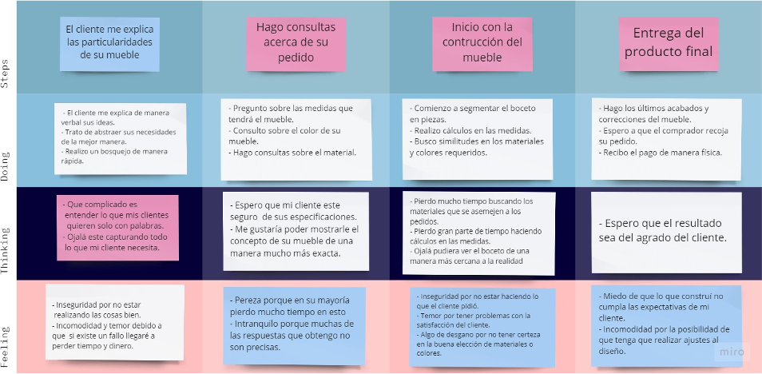

 </img> 

# Universidad Peruana de Ciencias Aplicadas  
## Ingeniería de Software - Ciclo V  
## Desarrollo de Aplicaciones Web  
## SV51  
## Profesor:  
Mori Paiva, Hugo Allan  
# Informe de Trabajo Final  
## SparkLabs  
## FurniGo  
## Profesor: 
Mori Paiva, Hugo Allan  

## Integrantes:  
- Cancho Coila, Diego Fabian U20201F479  
- Isla Quispe, Luis Fernando U202124146  
- Velarde Luyo, Piero Alberto U20211A620  
- Loli Ruiz, Renzo Javier U202161C993  
- Rondon Añaños, Cristopher U20201A291  
- 

## Registro de versiones del informe  

| Fecha | Version | Autor | Descripción |
| :---: | :---: | :---: | :---: |
| 01/01/2021 | 0.1 | TechSolutions | Creación del documento |
| 10/09/2023 | 0.2 | TechSolutions | Se agregaron los capítulos para la entrega de TB1 |

## Project Report Collaboration Insights  

## Contenido  
> ### Capitulo I: Introducción
> #### 1.1. Startup Profile
> ##### 1.1.1. Descripcion de la Startup
> ##### 1.1.2. Perfiles de Integrantes del equipo
> #### 1.2. Solution Profile
> ##### 1.2.1. Antecedentes y problematica
> ###### 1.2.2.1. Lean UX Problem Statements
> ##### 1.2.2. Lean UX Process 
> ###### 1.2.2.2. Lean UX Assumptions
> ###### 1.2.2.3. Lean UX Hypothesis Statements
> ###### 1.2.2.4. Lean UX Canvas
> #### 1.3. Segmentos Objetivos
> ### Capitulo II: Requirements Elicitation & Analysis
> #### 2.1. Competidores
> ##### 2.1.1. Analisis Competitivo
> ##### 2.1.2. Estrategias y tacticas frente a competidores
> #### 2.2. Entrevistas  
> ##### 2.2.1. Diseño de entrevistas  
> ##### 2.2.2. Registro de entrevistas
###### Datos del entrevistado
-   Nombres: Danely
-   Apellidos: Valdez Acosta
-   Edad: 23 años
-   Ciudad: Ayacucho
[Enlace al video](https://www.youtube.com/watch?v=o_xySO8XUd4)
    - Resumen:
    La señorita Danely, tiene 23 años y es estudiante, ella radica en la ciudad de Ayacucho, es soltera y no tiene hijos. Se considera una persona introvertida y sensitiva. Realiza dos a tres veces al año compras por internet, suele comprar artículos deportivos y tecnológicos.
    Actualmente no cuenta con una tienda online preferida, depende de lo que encuentre por internet, en cuanto al precio, no tiene mucho conocimiento a este producto, lo adquiere por el modelo. Cuando desea adquirir un mueble, identifica el uso que le dará al mueble, el tamaño de este, si va a coincidir con el espacio que tiene en casa, piensa en posibles colores y modelos ingresa a internet y busca un modelo similar a lo pensado inicialmente, cree que todo ese proceso puede mejorar si fuera más personalizada ya que no encuentra lo que busca a veces. La cliente no conoce una aplicación o carpintería que use una App o un software. A la vez, considera que sería muy interesante usarla, ya que le ayudaría a plasmar lo que realmente está buscando en cuanto al modelo, sin embargo, en cuanto al material, no tiene conocimiento, pero estaría dispuesta recibir ayuda de un experto. Cree que es primordial que la aplicación le ofrezca seguridad, que sea una aplicación intuitiva, a la vez, recomendaría la app, siempre y cuando cumpla con sus expectativas.
    La cliente considera que tiene un rango de 8 en el uso de smartphones, uso de computadoras un rango 7, uso de navegadores en smartphones 7, navegadores de internet en computadora rango 8, apps de escritorio 8, apps móviles 8, la señorita utiliza dispositivos como un celular y laptop y tiene conocimiento de navegadores como Google y Mozilla Firefox.

> ##### 2.2.3. Analisis de entrevistas 
> #### 2.3. Needfinding
> ##### 2.3.1. User Personas

> ##### 2.3.2. User Task Matrix

> ##### 2.3.4. Empathy Mapping

### Segmento Cliente

### Segmento Carpintero
> ##### 2.3.5. As-is Scenario Mapping

> ### Capitulo III: Requirements Specification
> #### 3.1. To-Be Scenario Mapping
> #### 3.2. User Stories 
> #### 3.3. Impact Mapping
> #### 3.4. Product Backlog
> ### Capitulo IV: Product  Design
> #### 4.1. Style Guidelines 
> ##### 4.1.1 General Style Guidelines 
> ##### 4.1.2. Web Style Guidelines
> #### 4.2. Information Architecture
> ##### 4.2.1. Organization Systems
> ##### 4.2.2. Labeling Systems
> ##### 4.2.3. SEO Tags and Meta Tags
> ##### 4.2.4. Searching Systems
> ##### 4.2.5. Navigation Systems  
> #### 4.3. Landing Page UI Design
> ##### 4.3.1. Landing Page Wireframe
> ##### 4.3.2. Landing Page Mock-up
> #### 4.4. Web Applications UX/UI Desing
> ##### 4.4.1. Web Application Wireframes
> ##### 4.4.2. Web Application Wireflow Diagrams
> ##### 4.4.3. Web Application Mock-ups
> ##### 4.4.4. Web Application User Flow Diagrams
> #### 4.5. Web Applications Prototyping
> #### 4.6. Domain-Drive Software Architecture
> ##### 4.6.1 Software Architecture Context Diagram
> ##### 4.6.2. Software Architecture Container Diagrams
> ##### 4.6.3. Software Architecture Components Diagrams
> #### 4.7. Software Object-Oriented Design
> ##### 4.7.1 Class Diagrams
> ##### 4.7.2. Class Dictionary
> #### 4.8. Database Design
> ##### 4.8.1. Databse Diagram

> ### Capitulo V: Product Implementation, Validation & Deployment
> #### 5.1. Software Configuration Management
> ##### 5.1.1. Software Development Environment  
> ##### 5.1.2. Source Code Management 
> ##### 5.1.3. Source Code Style Guide & Conventions
> ##### 5.1.4. Software Deployment Configuration
> #### 5.2 Landing Page, Services & Applications 
> ##### 5.2.1. Sprint 1
> ###### 5.2.1.1. Sprint Planning 1
> ###### 5.2.1.2. Sprint Backlog 1 
> ###### 5.2.1.3. Development Evidence for Sprint Review
> ###### 5.2.1.4. Testing Suite Evidence for Sprint Review
> ###### 5.2.1.5. Execution Evidence for Sprint Review
> ###### 5.2.1.6. Services Documentation Evidence for Sprint Review
> ###### 5.2.1.7. Software Deployment Evidence for Sprint Review
> ###### 5.2.1.8. Team Collaboration Insights during Sprint  