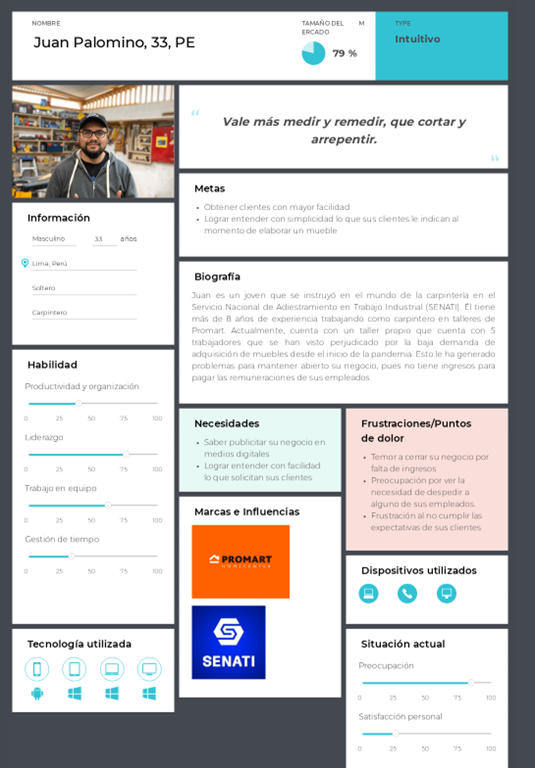

### 2.3.1 User Personas  
  
  

### 2.3.2 User Task Matrix  
<table style="undefined;table-layout: fixed; width: 550px">
<tbody>
<tr>
    <td rowspan="2">Task Matrix</td>
    <td colspan="2">Cliente</td>
    <td colspan="2">Carpintero</td>
  </tr>
  <tr>
    <td>Frecuencia</td>
    <td>Importancia</td>
    <td>Frecuencia</td>
    <td>Importancia</td>
  </tr>
  <tr>
    <td>Buscar información de talleres de carpintería confiables</td>
    <td>Media</td>
    <td>Alta</td>
    <td>-</td>
    <td>-</td>
  </tr>
  <tr>
    <td>Buscar modelos de muebles en internet</td>
    <td>Media</td>
    <td>Alta</td>
    <td>Alta</td>
    <td>Alta</td>
  </tr>
  <tr>
    <td>Realizar un bosquejo de lo que de lo que deseo</td>
    <td>Media</td>
    <td>Alta</td>
    <td>-</td>
    <td>-</td>
  </tr>
  <tr>
    <td>Investigar qué materiales me convienen para mi mueble</td>
    <td>Media</td>
    <td>Alta</td>
    <td>Baja</td>
    <td>Alta</td>
  </tr>
  <tr>
    <td>Contactar a algún taller que pueda realizar lo que deseo</td>
    <td>Alta</td>
    <td>Alta</td>
    <td>-</td>
    <td>-</td>
  </tr>
  <tr>
    <td>Acordar tiempo de entrega del mueble</td>
    <td>Media</td>
    <td>Alta</td>
    <td>Media</td>
    <td>Alta</td>
  </tr>
  <tr>
    <td>Reunirse para afinar detalles</td>
    <td>Media</td>
    <td>Alta</td>
    <td>Media</td>
    <td>Alta</td>
  </tr>
  <tr>
    <td>Definir un presupuesto</td>
    <td>Media</td>
    <td>Alta</td>
    <td>Media</td>
    <td>Alta</td>
  </tr>
  <tr>
    <td>Comprar materiales</td>
    <td>-</td>
    <td>-</td>
    <td>Alta</td>
    <td>Alta</td>
  </tr>
  <tr>
    <td>Realizar medidas</td>
    <td>-</td>
    <td>-</td>
    <td>Alta</td>
    <td>Alta</td>
  </tr>
  <tr>
    <td>Construir las partes del mueble</td>
    <td>-</td>
    <td>-</td>
    <td>Alta</td>
    <td>Alta</td>
  </tr>
  <tr>
    <td>Armar el mueble</td>
    <td>-</td>
    <td>-</td>
    <td>Alta</td>
    <td>Alta</td>
  </tr>
  <tr>
    <td>Afinar detalles del mueble</td>
    <td>Baja</td>
    <td>Alta</td>
    <td>Media</td>
    <td>Alta</td>
  </tr>
  <tr>
    <td>Entrega del mueble terminado</td>
    <td>Media</td>
    <td>Alta</td>
    <td>Alta</td>
    <td>Alta</td>
  </tr>
  </tbody>
</table>