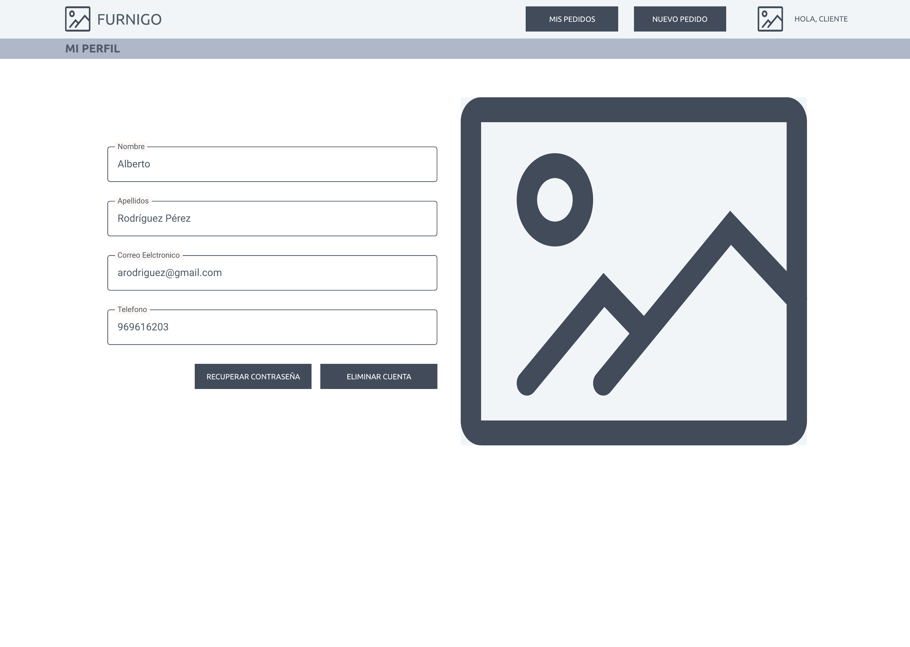
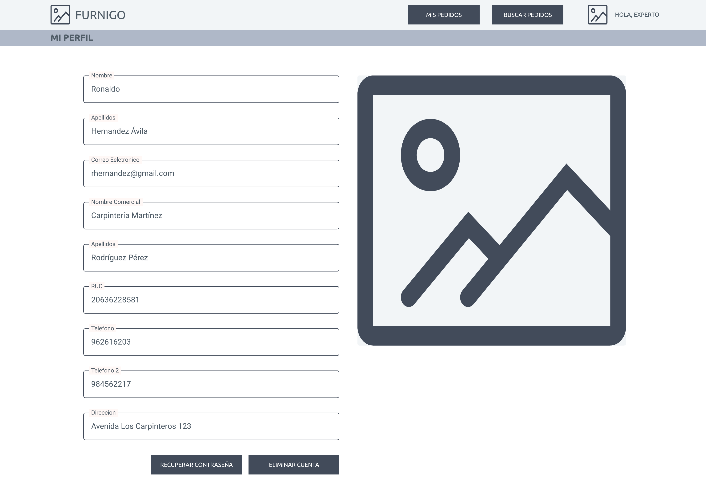
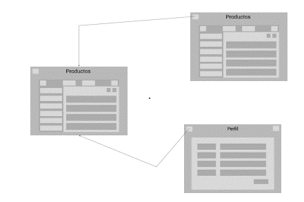
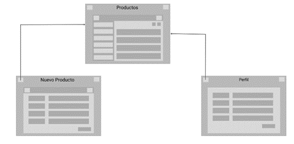

La aplicacion sera similar entre el cliente y experto pero tendra todo lo necesario para cada uno.  
### 4.4.1. Web Applications Wireframes  
El cliente y el experto tendran tres secciones en las que podran:  
1. Cliente: Ver modelos con la lista de expertos que aceptan y sus perfiles, Añadir un nuevo modelo y Ver/Actualizar perfil.  
2. Experto: Explorar modelos, Ver modelos aceptados y Ver/Actualizar perfil.  

**Client wireframes:**  

  
  
  

**Expert wireframes:**  
  
  
  

### 4.4.2. Web Applications Wireflow Diagrams  
Tanto el usuario como el experto tendran 3 secciones. Con botones para regresar a la seccion principal de cada uno. El perfil del experto aparecera primero al registrarse.  

**Expert Wireflow Diagrams:**  
  

**Client Wireflow Diagrams:**  
  

### 4.4.3 Web Applications Mockups  
**Client mockups:**  
  
  
  

**Expert mockups:**

### 4.4.4 Web Applications User Flow Diagrams  
**Expert Wireflow Diagrams:**  
  

**Client Wireflow Diagrams:**  
  
