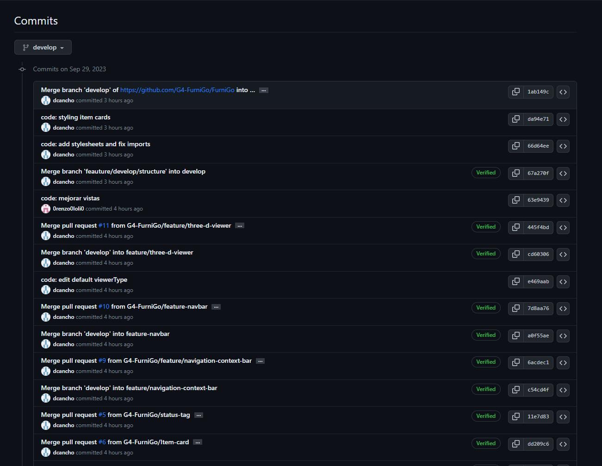
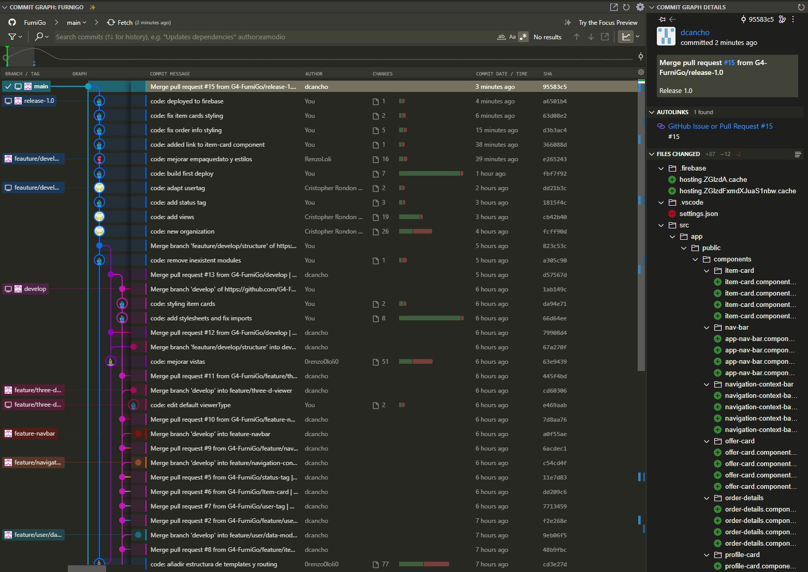

### 5.2.1 Sprint 1:  
#### 5.2.1.1 Sprint planning 1  
| Sprint 1 | Implementación de funcionalidades y diseño de la Landing Page |
| --- | --- |
| **Sprint Planning Background** |
| Date | 10/09/2023 |
| Time  | 18:00 |
| Location | Reunión realizada mediante Google Meet |
| Attendees | Diego Cancho Coila, Piero Velarde Luyo. Renzo Loli Ruiz, Cristopher Rondón Añaños, Luis Isla Quispe |
| **Sprint Goal & User Stories**   |
| Sprint 1 Goal | Realizar y desplegar el landing page |
| Sprint 1 Velocity | 20 |
| Sum of Story Points |  |
#### 5.2.1.2 Sprint Backlog 1  
| id | Title | Id  | Title | Description | Estimations(Hours) | Assigned To | Status(To-do /InProcess/ToReview/Done) |
| --- | --- | --- | --- | --- | --- | --- | --- |

#### 5.2.1.3. Development Evidence for Sprint Review  
| Repository   | Branch | Commit Id | Commit Message | Commit Message Body | Commited on (Date) |
| --- | --- | --- | --- | ---- | --- |
| FurniGo-LandingPage | feature/develop |  | Feature:  | Feature(L. Page):…. | 10/09/2023 |
| FurniGo-LandingPage | feature/develop |  | Feature:  | Feature(L. Page):…. | 10/09/2023 |
| FurniGo-LandingPage | feature/develop |  | Feature:  | Feature(L. Page):…. | 10/09/2023 |
| FurniGo-LandingPage | feature/develop |  | Feature:  | Feature(L. Page):…. | 10/09/2023 |
| FurniGo-LandingPage | feature/develop |  | Feature:  | Feature(L. Page):…. | 10/09/2023 |

#### 5.2.1.4. Testing Suite Evidence for Sprint Review  
En esta entrega no se incluyó contenido aplicable a la lógica de negocio, por lo que no se incluye evidencia de pruebas unitarias.
#### 5.2.1.5. Execution Evidence for Sprint Review  
Enlace del landing page en ejecución: [Vídeo de ejecución en Microsoft Stream](www.google.com)
#### 5.2.1.6. Services Documentation Evidence for Sprint Review  
En esta entrega no se requirió el uso de servicios externos al ser el landing page una página estática que no requiere de ellos.  
#### 5.2.1.7. Software Deployment Evidence for Sprint Review  
El landing page se desplegó en GitHub Pages, un servicio para el hosting de páginas estáticas. 
Enlace del landing page desplegado en GitHub Pages: [Enlace](https://github.com/G4-FurniGo/FurniGo-LandingPage)
#### 5.2.1.8. Team Collaboration Insights during Sprint  
Tanto para la elaboración del reporte como para el landing page, se utilizaron repositorios en GitHub y la metodología GitFlow. Para esto, usando Visual Studio Code y la integración con Git, se realizaron commits a las branches correspondientes, y se realizaron pull requests para la revisión de los cambios.
  
  

### 5.2.2 Sprint 2:
#### 5.2.2.1 Sprint planning 2
| Sprint 2 | Implementación de front-end page |
| --- | --- |
| **Sprint Planning Background** |  |
| Date | 16/09/2023, 23/09/2023 |
| Time  | 15:00-16:00, 15:00-17:00 |
| Location | Reuniones presenciales en Campus UPC San Miguel  |
| Prepared by | Diego Cancho Coila |
| Attendees | Diego Cancho Coila, Piero Velarde Luyo. Renzo Loli Ruiz, Cristopher Rondón Añaños (Virtual), Luis Isla Quispe |
| **Sprint Goal & User Stories**   |
| Sprint 2 Goal | Realizar y desplegar el front-end webpage |
| Sprint 2 Velocity | 20 |
| Sum of Story Points | 22 |

#### 5.2.2.2 Sprint Backlog 2
| ID | Title | Description | Estimation | Assigned to | Status |
| --- | --- | --- | --- | --- |--- |
| 183309406 | Visualizar historial de pedidos completados. | Como usuario Taller quiero poder visualizar el historial de pedidos que he completado. | 3 | Renzo Loli Ruiz | Done|
| 183309408 | Ver Lista de Pedidos en Pantalla Principal. | Como cliente, quiero ver una lista de mis pedidos en la pantalla principal de la plataforma para facilitar el acceso y seguimiento de mis pedidos. | 5 | Christian Rondon Añaños | Done |
| 183309410 | Ver Detalles de un Pedido Nuevo | Como cliente, quiero ver la información detallada de un nuevo pedido, y si el pedido aún no ha sido aceptado, para tener un registro completo y actualizado de mis pedidos pendientes. | 5 | Diego Cancho Coila | Done |
| 183309411 | Editar Detalles de un Pedido Nuevo | Como cliente, quiero tener la opción de editar la información introducida de mi pedido, como la descripción, fecha, presupuesto y modelo del mueble, para corregir o actualizar la información de manera oportuna si es necesario. | 3 | Piero Velarde Luyo | Done |
| 183309412 | Ver Información de un Pedido Existente | Como cliente quiero ser redirigido a una pantalla que muestre información detallada, incluyendo descripción, fecha, presupuesto y modelo del mueble, para poder acceder fácilmente a los detalles de mis pedidos anteriores. | 3 | Luis Isla Quispe | Done |
|183309414 | Acceder a la Información del Carpintero que Aceptó el Pedido | 	Como cliente, quiero poder acceder a la información del carpintero que aceptó mi pedido, incluyendo detalles sobre proyectos anteriores y experiencia, para conocer más sobre la experiencia y el historial del carpintero que trabaja en mi pedido. | 3 | Renzo Loli Ruiz | Done |

#### 5.2.2.3 Development Evidence for Sprint Review
| Repository | Branch | Commit ID | Commit message | Commit message body | Commited on (Date) |
| --- | --- | --- | --- | --- | --- |
| FurniGo | feature/components | 0384b97 | code: remove unexistent comoponent importing | - | 29/09/2023 |
| FurniGo | feature/develop/structure | 1815f4c | code: add status tag | - | 30/09/2023 |
| FurniGo | feature/user/data-modify-create | 9eb06f5 | Merge branch 'develop' into feature/user/data-modify-create | - | 29/09/2023 |
| FurniGo | feature/user-tag | 41a2fea | User tag | - | 29/09/2023 |
| FurniGo | feature/navbar | a0f55ae | Merge branch 'develop' into feature-navbar | - | 29/09/2023 |

#### 5.2.2.4 Testing Suite Evidence for Sprint Review
En esta entrega no se incluyó contenido aplicable a la lógica de negocio, por lo que no se incluye evidencia de pruebas unitarias.
#### 5.2.2.5 Execution Evidence for Sprint Review
Enlace del front-end en ejecución: [Vídeo de ejecución en Microsoft Stream](www.google.com)
#### 5.2.2.6 Services Documentation Evidence for Sprint Review
Para el desarrollo del front-end webpage no se requirió de servicios externos.

#### 5.2.2.7 Software Deployment Evidence for Sprint Review
Para el despliegue de nuestro front-end, utilizamos el servicio de hosting de Google Firebase, el cual aloja el código fuente de nuestro front-end y lo despliega en un servidor web de Google, el cual se puede acceder mediante un enlace.
Enlace del front-end desplegado en Google Firebase: [Enlace](https://furnigo-27944.web.app/order/list)
#### 5.2.2.8 Team Collaboration Insights during Sprint
Para el desarrollo del presente sprint, se siguió utilizando Git, GitHub y la metodología GitFlow, haciendo uso de ramas para la introducción de nuevas características.
A partir de un repositorio main, se clonó una rama develop para llevar a cabo los desarrollos necesarios en otras sub-ramas feature, las cuales se van integrando a la rama develop. Finalmente, antes del deployment, se crea una rama release, la cual luego se integra tanto a la rama main y la rama develop, siendo la primera la cual se despliega en Google Firebase.

  
  