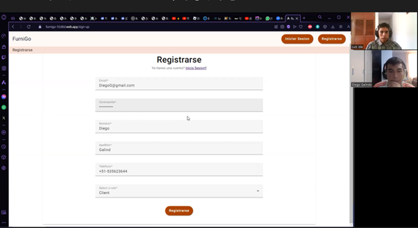
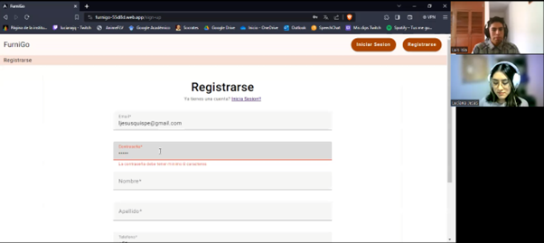

### 5.3.1 Diseño de Entrevistas
Preguntas:

Nombres y Apellidos
Edad
Ocupación
Distrito

-Se le pide que realice las tareas

Preguntas realizadas luego de culminar con las tareas asignadas:
¿Tienes alguna recomendación o mejora para estas tareas en concreto?
¿Se te dificulta en alguna parte al realizar estas tareas?

### 5.3.2 Registro de Entrevistas

Entrevista 1

**Link del video:** [video](https://upcedupe-my.sharepoint.com/:v:/g/personal/u202124146_upc_edu_pe/EYuV8uP_kANDjN5f_yVVZBUBWMRn8awENdL3wBLYuS0zwA?nav=eyJyZWZlcnJhbEluZm8iOnsicmVmZXJyYWxBcHAiOiJPbmVEcml2ZUZvckJ1c2luZXNzIiwicmVmZXJyYWxBcHBQbGF0Zm9ybSI6IldlYiIsInJlZmVycmFsTW9kZSI6InZpZXciLCJyZWZlcnJhbFZpZXciOiJNeUZpbGVzTGlua0RpcmVjdCJ9fQ&e=6kF3GS)
- **Tiempo de vídeo:** 3:05 minutos
- **Segmento objetivo:** Cliente
- **Fecha entrevista:** 10/11/2023
- **Nombres y apellidos:** Diego Alejandro Galindo Rioz
- **Edad:** 19
- **Distrito:** Bellavista

| Resumen |  |
|---------|--------------------------------------------------|
| Se realizó una entrevista a un estudiante potencialmente interesado en adquirir muebles. Se le pidió que realizara las siguientes tareas: | Registrarse, ver sus pedidos, realizar y publicar un pedido, ver que el pedido se publicó y editarlo. |
| Luego se le preguntó acerca de su experiencia: | El entrevistado mencionó que no tuvo ningún problema realizando estas tareas y solo tuvo una sugerencia relacionada con los URL de los modelos 3D. Sugirió que se permitiera poner más de uno. |

Entrevista 2

**Link del video:** [video](https://upcedupe-my.sharepoint.com/:v:/g/personal/u202124146_upc_edu_pe/EabSRTzZ3dJMtSLIZ_YFkeUBnOnjN1BKuPwXB9SFuqZtxQ?nav=eyJyZWZlcnJhbEluZm8iOnsicmVmZXJyYWxBcHAiOiJPbmVEcml2ZUZvckJ1c2luZXNzIiwicmVmZXJyYWxBcHBQbGF0Zm9ybSI6IldlYiIsInJlZmVycmFsTW9kZSI6InZpZXciLCJyZWZlcnJhbFZpZXciOiJNeUZpbGVzTGlua0RpcmVjdCJ9fQ&e=GBsPec)
- **Tiempo de vídeo:** 4:33 minutos
- **Segmento objetivo:** Experto
- **Fecha entrevista:** 10/11/2023
- **Nombres y apellidos:** Luciana Graciela Jesus Quispe
- **Edad:** 19
- **Distrito:** San Juan de Lurigancho

| Resumen |  |
|---------|-------------------------------|
| Se realizó una entrevista a Luciana Jesus, actuando como si fuera del segmento objetivo experto. En este caso, sería un carpintero interesado en ver y aceptar los pedidos solicitados por algún otro cliente. Entre las tareas que se le solicitó realizaron: | Registrarse como experto, ver sus pedidos, buscar pedidos realizados, aceptar el pedido y ver el pedido y la oferta. |
| Luego se le preguntó acerca de su experiencia: | La entrevistada mencionó que no tuvo muchos problemas realizando las tareas, a excepción de la parte de realizar la oferta del pedido, ya que se le dificultó encontrar el botón de aceptar. |

### 5.3.3 Evaluaciones según heurísticas

### 5.3.4 Video About-the-Product
