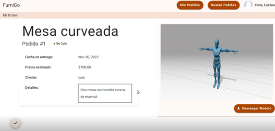

### 5.3.1 Diseño de Entrevistas
Preguntas:

Nombres y Apellidos
Edad
Ocupación
Distrito

-Se le pide que realice las tareas

Preguntas realizadas luego de culminar con las tareas asignadas:
¿Tienes alguna recomendación o mejora para estas tareas en concreto?
¿Se te dificulta en alguna parte al realizar estas tareas?

### 5.3.2 Registro de Entrevistas

Entrevista 1

**Link del video:** [video](https://upcedupe-my.sharepoint.com/:v:/g/personal/u202124146_upc_edu_pe/EYuV8uP_kANDjN5f_yVVZBUBWMRn8awENdL3wBLYuS0zwA?nav=eyJyZWZlcnJhbEluZm8iOnsicmVmZXJyYWxBcHAiOiJPbmVEcml2ZUZvckJ1c2luZXNzIiwicmVmZXJyYWxBcHBQbGF0Zm9ybSI6IldlYiIsInJlZmVycmFsTW9kZSI6InZpZXciLCJyZWZlcnJhbFZpZXciOiJNeUZpbGVzTGlua0RpcmVjdCJ9fQ&e=6kF3GS)
- **Tiempo de vídeo:** 3:05 minutos
- **Segmento objetivo:** Cliente
- **Fecha entrevista:** 10/11/2023
- **Nombres y apellidos:** Diego Alejandro Galindo Rioz
- **Edad:** 19
- **Distrito:** Bellavista

| Resumen |  |
|---------|--------------------------------------------------|
|Se realizó una entrevista a un estudiante potencialmente interesado en adquirir muebles, se le pidió que realice las tareas de Registrarse, ver sus pedidos, Realizar y publicar un pedido, ver que el pedido se publicó y editarlo. Luego se le pregunto como fue con las entrevistas siendo que dice que no tuvo ningún problema realizando estas tareas y solo tuvo una sugerencia relacionado con los url de los modelos 3d, que deje poner más de uno.|

Entrevista 2

**Link del video:** [video](https://upcedupe-my.sharepoint.com/:v:/g/personal/u202124146_upc_edu_pe/EabSRTzZ3dJMtSLIZ_YFkeUBnOnjN1BKuPwXB9SFuqZtxQ?nav=eyJyZWZlcnJhbEluZm8iOnsicmVmZXJyYWxBcHAiOiJPbmVEcml2ZUZvckJ1c2luZXNzIiwicmVmZXJyYWxBcHBQbGF0Zm9ybSI6IldlYiIsInJlZmVycmFsTW9kZSI6InZpZXciLCJyZWZlcnJhbFZpZXciOiJNeUZpbGVzTGlua0RpcmVjdCJ9fQ&e=GBsPec)
- **Tiempo de vídeo:** 4:33 minutos
- **Segmento objetivo:** Experto
- **Fecha entrevista:** 10/11/2023
- **Nombres y apellidos:** Luciana Graciela Jesus Quispe
- **Edad:** 19
- **Distrito:** San Juan de Lurigancho

| Resumen |  |
|---------|-------------------------------|
|Se realizó una entrevista a Luciana Jesus, actuando como si fuera del segmento objetivo experto, en este caso sería un carpintero interesado en ver y aceptar los pedidos solicitados por algún otro cliente, entre las tareas que se le solicitó fueron registrarse como experto, ver sus pedidos, buscar pedidos realizados, aceptar el pedido y ver el pedido y la oferto. Luego se le pregunto como fue con las entrevistas siendo que dice que no tuvo muchos problemas realizando las tareas a excepción de la parte de realizar la oferta del pedido, ya que se le dificulto encontrar el botón de aceptar|

### 5.3.3 Evaluaciones según heurísticas

Evaluación del Sitio: FurniGo

Tarea a Evaluar:
El alcance de esta evaluación incluye la revisión de la usabilidad de las siguientes tareas:

1. Inicio de sesión de usuario
2. Registro de usuario
3. Visualización de pedidos solicitados
4. Publicar pedido
5. Buscar pedido
6. Aceptar pedido
7. Visualización de pedidos aceptados
8. Aceptar oferta realizada

No están incluidas en esta versión de la evaluación las siguientes tareas:

1. Notificación de cambio de estado
2.
3.
4.
5.

Escala de Severidad:
Los errores serán puntuados tomando en cuenta la siguiente escala de severidad:

- **Nivel 1:** Problema superficial: puede ser fácilmente superado por el usuario ó ocurre con muy poca frecuencia. No necesita ser arreglado a no ser que exista disponibilidad de tiempo.
- **Nivel 2:** Problema menor: puede ocurrir un poco más frecuentemente o es un poco más difícil de superar para el usuario. Se le debería asignar una prioridad baja para resolverlo de cara al siguiente release.
- **Nivel 3:** Problema mayor: ocurre frecuentemente o los usuarios no son capaces de resolverlos. Es importante que sean corregidos y se les debe asignar una prioridad alta.
- **Nivel 4:** Problema muy grave: un error de gran impacto que impide al usuario continuar con el uso de la herramienta. Es imperativo que sea corregido antes del lanzamiento.

Tabla Resumen:

| #  | Problema                                             | Escala de Severidad | Heurística/Principio Violado(o)              |
|----|------------------------------------------------------|---------------------|---------------------------------------------|
| 1  | No es tan intuitivo para comprender y encontrar opciones | 2               | Usability: Diseño estético y minimalista    |
| 2  |                                                      |                   |                                             |

Descripción de Problemas:

PROBLEMA #1: No es tan intuitivo para comprender y encontrar opciones

- **Severidad:** 2
- **Heurística Violada:** Usability: Diseño estético y minimalista

Problema:
Cuando un usuario intenta aceptar un pedido, se enfrenta a dificultades para encontrar la opción correspondiente en la interfaz. La falta de claridad y visibilidad de la función de aceptación podría generar confusión y frustración para el usuario, comprometiendo la experiencia de usuario.

Recomendación:
Destaca visualmente la opción de aceptar, ubicándola en una posición prominente y de fácil acceso. Utiliza colores llamativos o íconos intuitivos para resaltar la acción. Realiza pruebas de usabilidad para validar la eficacia del diseño.

### 5.3.4 Video About-the-Product
